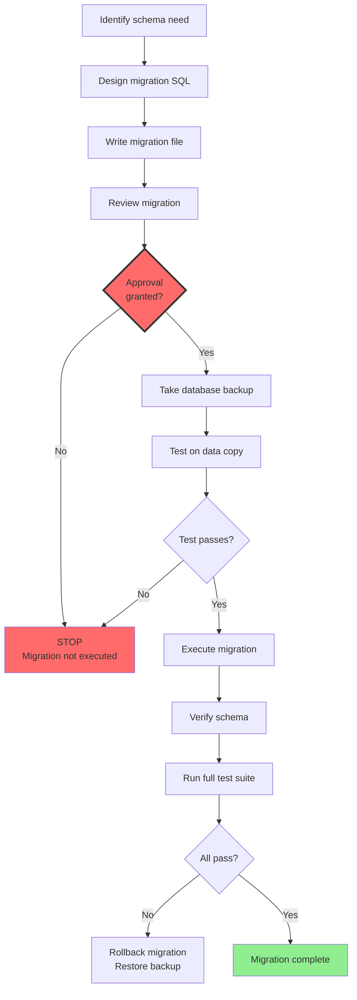

# Migration Approval Boundary

**Date:** 2026-08-20
**Status:** Gate between Prepare and Execute is CLOSED



## Current State

```
[Prepare migration] ----GATE (CLOSED)---- [Execute migration]
         ^                                        |
     COMPLETE                               NOT AUTHORIZED
```

## Proposed Migration

```sql
-- Prepared, NOT executed
PRAGMA foreign_keys = OFF;
PRAGMA legacy_alter_table = ON;

ALTER TABLE nft_credentials ADD COLUMN mint_operation_key TEXT;

CREATE UNIQUE INDEX idx_nft_cred_operation_key
  ON nft_credentials (user_id, course_id, mint_operation_key)
  WHERE mint_operation_key IS NOT NULL;

PRAGMA legacy_alter_table = OFF;
PRAGMA foreign_keys = ON;
```

Migration files may be prepared, but execution requires separate approval. The gate between preparation and execution is explicitly closed until approval is granted.
