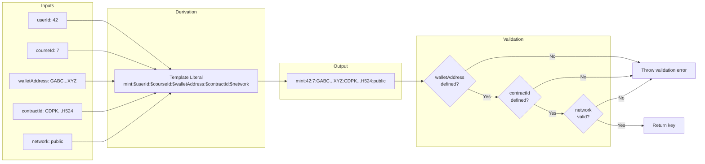

# Operation Key Derivation

```mermaid
flowchart LR
    subgraph Inputs
        U[userId: 42]
        C[courseId: 7]
        W[walletAddress: GABC...XYZ]
        X[contractId: CDPK...H524]
        N[network: public]
    end

    subgraph Derivation
        T[Template Literal<br/>mint:$userId:$courseId:$walletAddress:$contractId:$network]
    end

    subgraph Output
        K[mint:42:7:GABC...XYZ:CDPK...H524:public]
    end

    U --> T
    C --> T
    W --> T
    X --> T
    N --> T
    T --> K

    subgraph Validation
        V1{walletAddress<br/>defined?}
        V2{contractId<br/>defined?}
        V3{network<br/>valid?}
    end

    K --> V1
    V1 -->|No| ERR[Throw validation error]
    V1 -->|Yes| V2
    V2 -->|No| ERR
    V2 -->|Yes| V3
    V3 -->|No| ERR
    V3 -->|Yes| OK[Return key]
```
