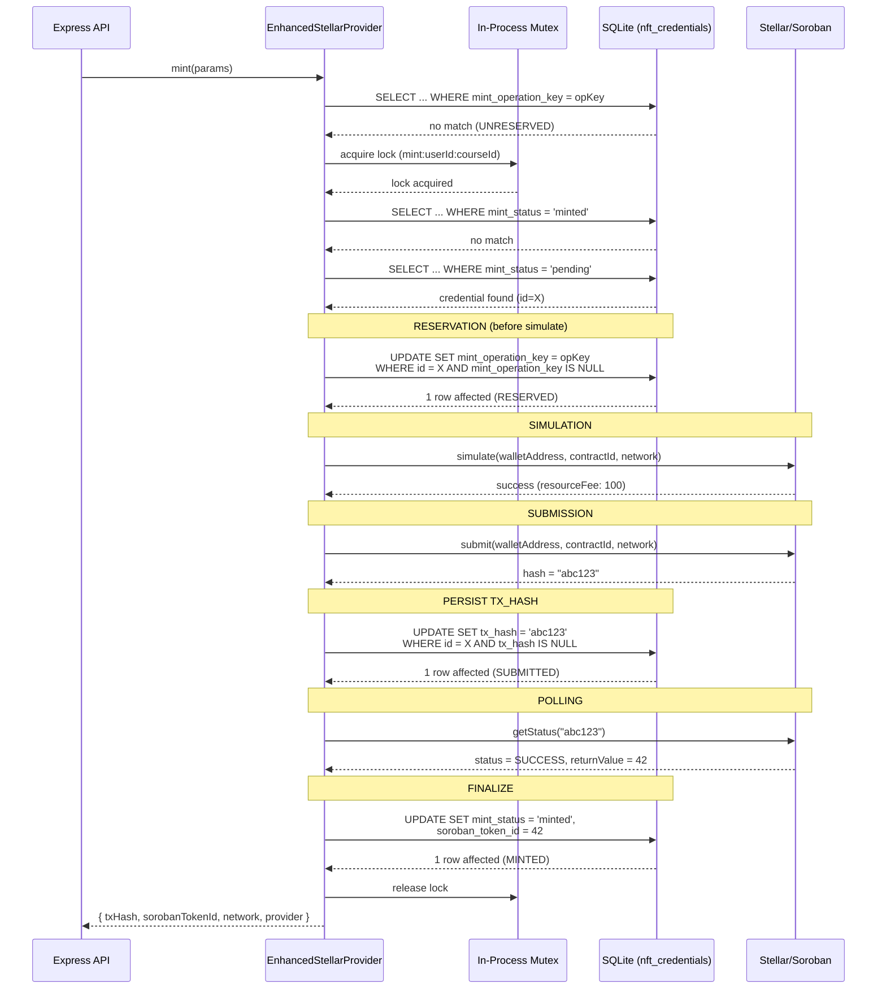

# Pre-Submit Reservation Flow

- **Date:** 2026-08-20
- **Related:** `2026-08-20-pre-submit-reservation-spec.md`

## Happy Path: Reserve -> Simulate -> Submit -> Poll -> Finalize

## Key Change from Current Implementation

The reservation step (setting `mint_operation_key`) now happens BEFORE simulation, not after submission. This closes the race window between simulation and submission.
