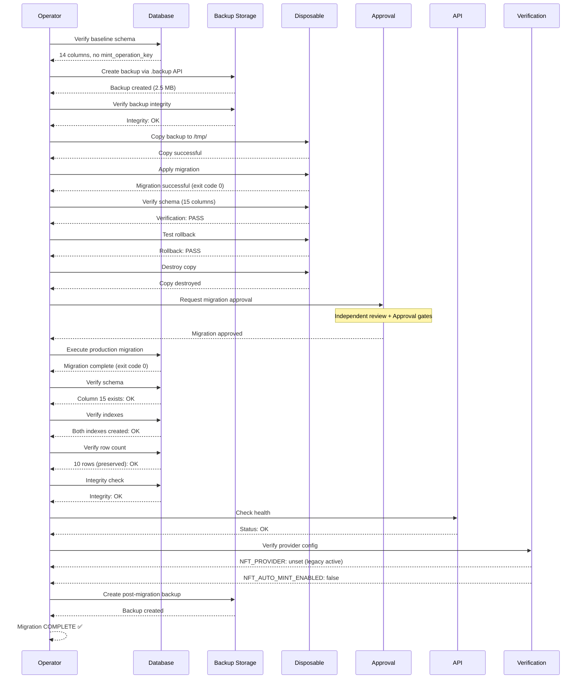
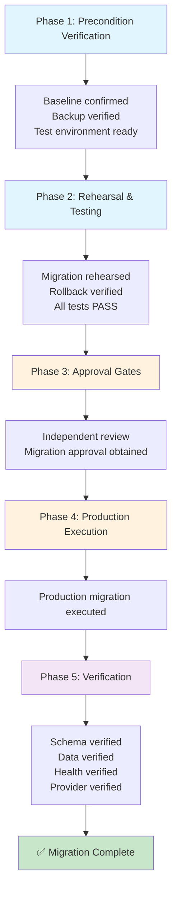
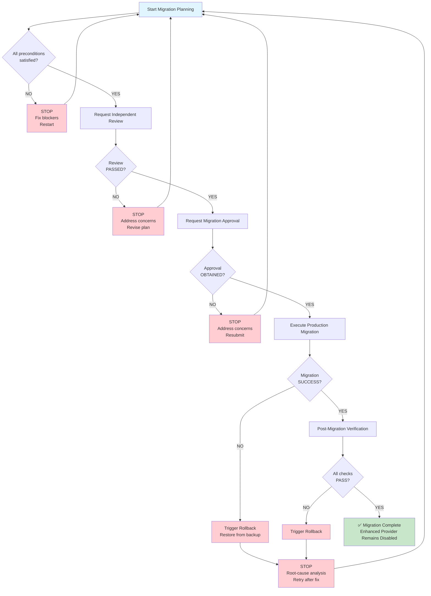

# Production Migration Flow Diagram
**Date:** 2026-08-20
**Document:** Sequence diagram showing migration workflow

---

## Migration Execution Sequence

---

## Migration Phases

---

## Critical Decision Points

---

## Approval Gate Progression

```mermaid
graph LR
    G1["G1: Release<br/>Identity ✅"] --> G2["G2: DB Target<br/>Confirmed ✅"]
    G2 --> G3["G3: Schema<br/>Baseline ✅"]
    G3 --> G4["G4: Backup<br/>Method ✅"]
    G4 --> G5["G5: Backup<br/>Integrity ✅"]
    G5 --> G6["G6: Migration<br/>Rehearsed ✅"]
    G6 --> G7["G7: Rollback<br/>Verified ✅"]
    G7 --> G8["G8: Independent<br/>Review ⏳"]
    G8 --> G9["G9: Migration<br/>Approval ⏳"]
    G9 --> G10["G10: Post-Migration<br/>Verification ⏳"]

    style G1 fill:#c8e6c9
    style G2 fill:#c8e6c9
    style G3 fill:#c8e6c9
    style G4 fill:#c8e6c9
    style G5 fill:#c8e6c9
    style G6 fill:#c8e6c9
    style G7 fill:#c8e6c9
    style G8 fill:#fff9c4
    style G9 fill:#fff9c4
    style G10 fill:#fff9c4
```

---

## References

- Migration Plan: `2026-08-20-production-migration-plan.md`
- Approval Gates: `2026-08-20-production-migration-approval-gates.md`
