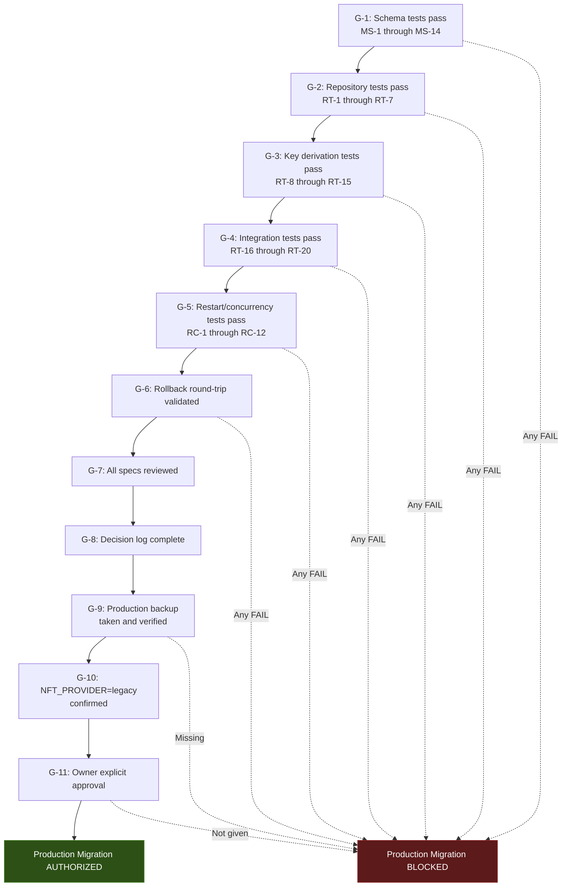
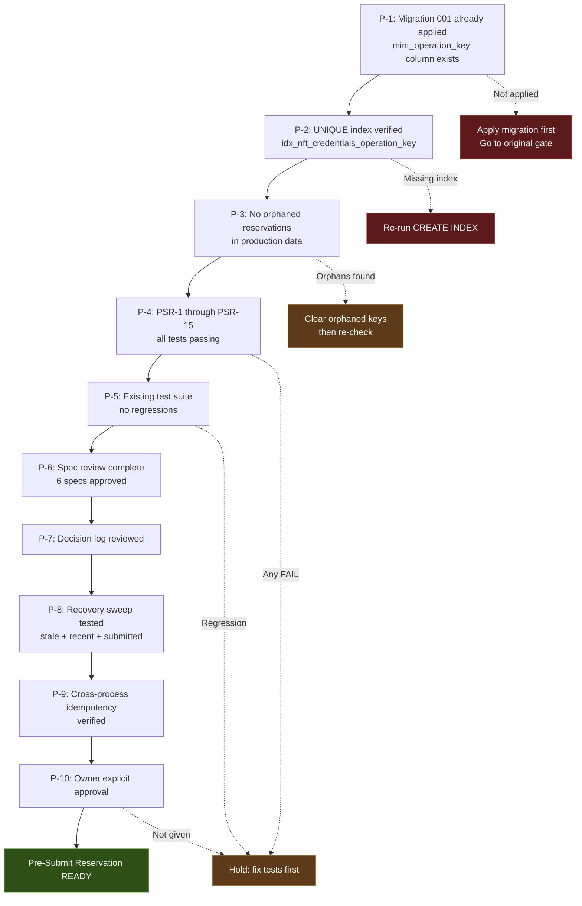
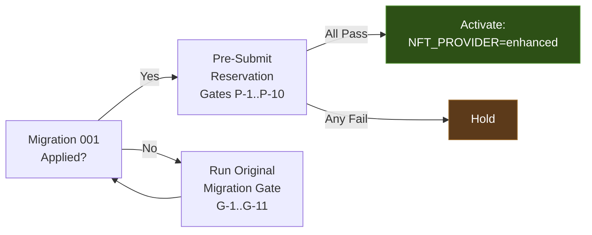

# Production Migration Gate

- **Date:** 2026-08-20 (updated for pre-submit reservation hardening)
- **Related:** `2026-08-20-production-migration-readiness-spec.md`, `2026-08-20-pre-submit-migration-plan.md`

## Original Migration Gate (001-add-mint-operation-key.sql)

## Pre-Submit Reservation Gate (No New Migration)

The pre-submit reservation hardening does NOT require a new migration. It reuses the existing `mint_operation_key` column and UNIQUE partial index. The gate below verifies that the original migration is applied and the new code is safe to activate.

## Combined Gate: Migration + Reservation Activation

