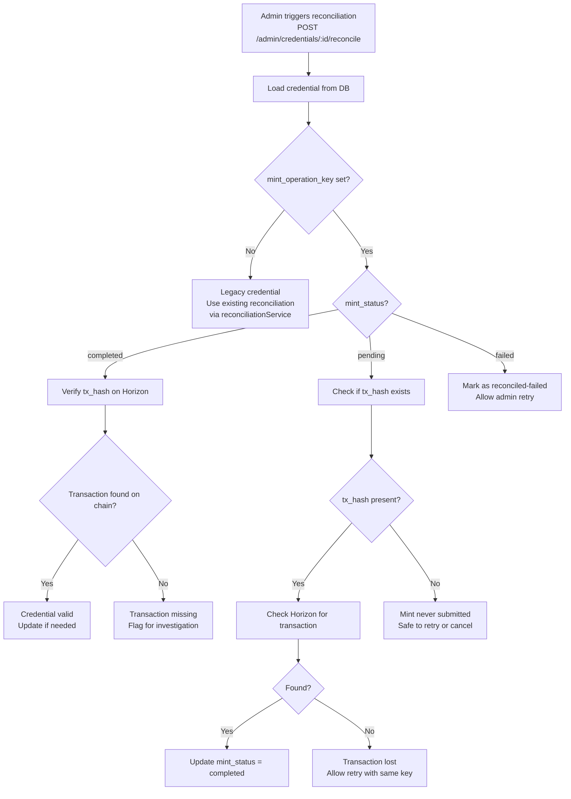

# Reconciliation Flow

```mermaid
flowchart TD
    A[Admin triggers reconciliation<br/>POST /admin/credentials/:id/reconcile] --> B[Load credential from DB]
    B --> C{mint_operation_key set?}
    C -->|No| D[Legacy credential<br/>Use existing reconciliation<br/>via reconciliationService]
    C -->|Yes| E{mint_status?}
    E -->|completed| F[Verify tx_hash on Horizon]
    E -->|pending| G[Check if tx_hash exists]
    E -->|failed| H[Mark as reconciled-failed<br/>Allow admin retry]
    F --> I{Transaction found on chain?}
    I -->|Yes| J[Credential valid<br/>Update if needed]
    I -->|No| K[Transaction missing<br/>Flag for investigation]
    G --> L{tx_hash present?}
    L -->|Yes| M[Check Horizon for transaction]
    L -->|No| N[Mint never submitted<br/>Safe to retry or cancel]
    M --> O{Found?}
    O -->|Yes| P[Update mint_status = completed]
    O -->|No| Q[Transaction lost<br/>Allow retry with same key]
```
