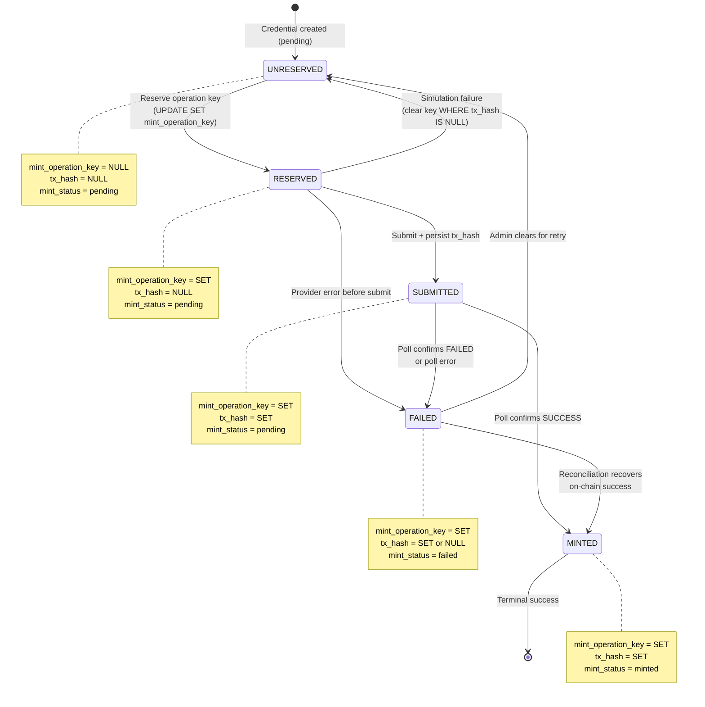

# Reservation State Machine Diagram

- **Date:** 2026-08-20
- **Related:** `2026-08-20-reservation-state-machine-spec.md`

## State Machine

## Column Values by State

| State | `mint_operation_key` | `tx_hash` | `mint_status` |
|-------|---------------------|-----------|---------------|
| UNRESERVED | NULL | NULL | pending |
| RESERVED | SET | NULL | pending |
| SUBMITTED | SET | SET | pending |
| MINTED | SET | SET | minted |
| FAILED | SET | SET or NULL | failed |

## Transition Guards

| Transition | SQL Guard |
|-----------|----------|
| UNRESERVED -> RESERVED | `WHERE mint_operation_key IS NULL` + UNIQUE index |
| RESERVED -> UNRESERVED | `WHERE tx_hash IS NULL` (prevents clearing submitted) |
| RESERVED -> SUBMITTED | `WHERE tx_hash IS NULL` (prevents double-write) |
| SUBMITTED -> MINTED | `WHERE mint_status = 'pending'` |
| SUBMITTED -> FAILED | `WHERE mint_status = 'pending'` |
| FAILED -> UNRESERVED | Manual admin action only |
