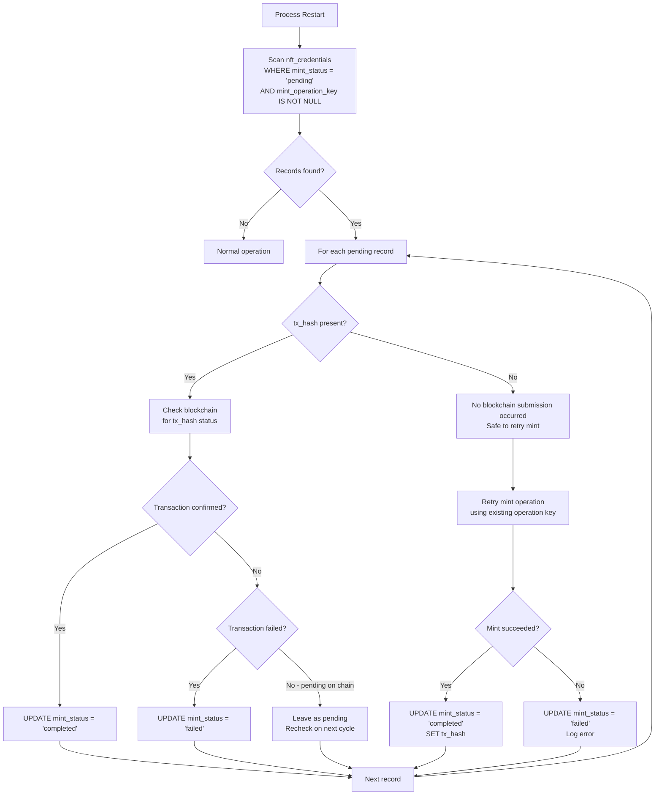

# Restart Recovery Flow

```mermaid
flowchart TD
    A[Process Restart] --> B[Scan nft_credentials<br/>WHERE mint_status = 'pending'<br/>AND mint_operation_key IS NOT NULL]
    B --> C{Records found?}
    C -->|No| D[Normal operation]
    C -->|Yes| E[For each pending record]
    E --> F{tx_hash present?}
    F -->|Yes| G[Check blockchain<br/>for tx_hash status]
    F -->|No| H[No blockchain submission occurred<br/>Safe to retry mint]
    G --> I{Transaction confirmed?}
    I -->|Yes| J[UPDATE mint_status = 'completed']
    I -->|No| K{Transaction failed?}
    K -->|Yes| L[UPDATE mint_status = 'failed']
    K -->|No - pending on chain| M[Leave as pending<br/>Recheck on next cycle]
    H --> N[Retry mint operation<br/>using existing operation key]
    N --> O{Mint succeeded?}
    O -->|Yes| P[UPDATE mint_status = 'completed'<br/>SET tx_hash]
    O -->|No| Q[UPDATE mint_status = 'failed'<br/>Log error]
    J --> R[Next record]
    L --> R
    M --> R
    P --> R
    Q --> R
    R --> E
```
