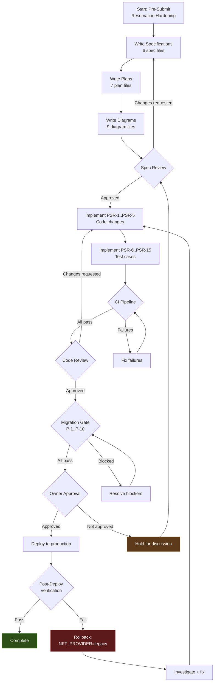

# Review Loop Diagram

- **Date:** 2026-08-20
- **Related:** `2026-08-20-pre-submit-reservation-loop.md`

## Review and Approval Loop

## Loop Invariants

At each review checkpoint:

1. **All existing tests still pass** (no regressions).
2. **Legacy provider is unaffected** (`NFT_PROVIDER=legacy` behavior unchanged).
3. **No new migration files** have been created.
4. **Decision log is up to date** with any changes made during the loop.
5. **A process-local mutex is an optimization, not the source of truth. The database reservation is the source of truth.**

## Estimated Loop Iterations

| Phase | Likely Iterations | Time per Iteration |
|-------|------------------|-------------------|
| Spec review | 1-2 | 30 minutes |
| Implementation + tests | 1-3 | 1-2 hours |
| CI | 1-2 | 5-10 minutes |
| Code review | 1-2 | 30 minutes |
| Migration gate | 1 | 15 minutes |
| Approval | 1 | async |

Total estimated: 3-6 hours of active work.
