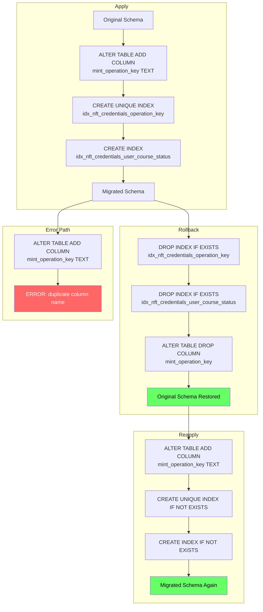

# Rollback and Reapply Flow

```mermaid
flowchart TD
    subgraph Apply
        A1[Original Schema] --> A2[ALTER TABLE ADD COLUMN<br/>mint_operation_key TEXT]
        A2 --> A3[CREATE UNIQUE INDEX<br/>idx_nft_credentials_operation_key]
        A3 --> A4[CREATE INDEX<br/>idx_nft_credentials_user_course_status]
        A4 --> A5[Migrated Schema]
    end

    subgraph Rollback
        A5 --> R1[DROP INDEX IF EXISTS<br/>idx_nft_credentials_operation_key]
        R1 --> R2[DROP INDEX IF EXISTS<br/>idx_nft_credentials_user_course_status]
        R2 --> R3[ALTER TABLE DROP COLUMN<br/>mint_operation_key]
        R3 --> R4[Original Schema Restored]
    end

    subgraph Reapply
        R4 --> RA1[ALTER TABLE ADD COLUMN<br/>mint_operation_key TEXT]
        RA1 --> RA2[CREATE UNIQUE INDEX IF NOT EXISTS]
        RA2 --> RA3[CREATE INDEX IF NOT EXISTS]
        RA3 --> RA4[Migrated Schema Again]
    end

    subgraph Error Path
        A5 --> E1[ALTER TABLE ADD COLUMN<br/>mint_operation_key TEXT]
        E1 --> E2[ERROR: duplicate column name]
    end

    style E2 fill:#f66,color:#fff
    style R4 fill:#6f6,color:#000
    style RA4 fill:#6f6,color:#000
```
