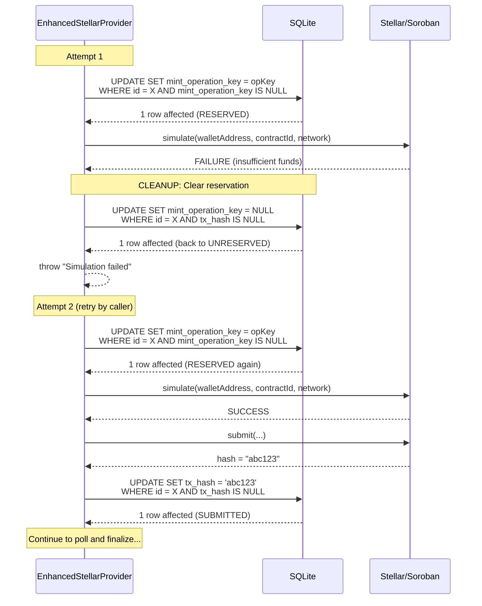
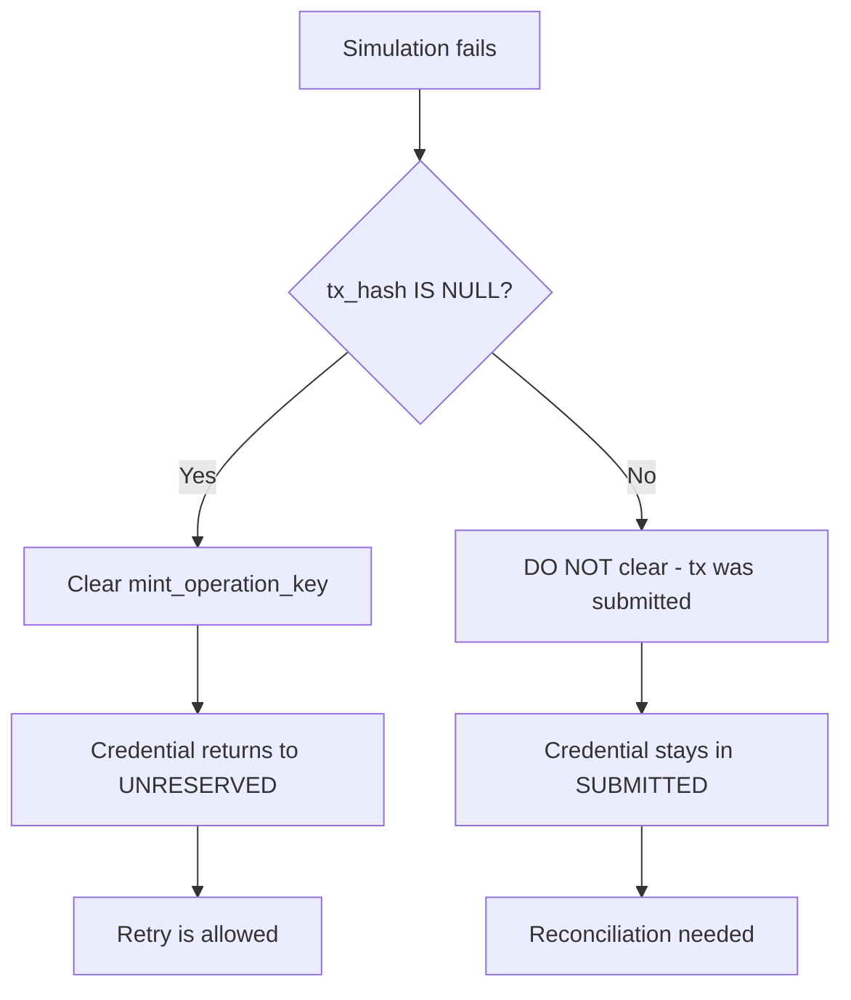

# Simulation Failure Recovery Diagram

- **Date:** 2026-08-20
- **Related:** `2026-08-20-pre-submit-reservation-spec.md`

## Simulation Failure: Reserve -> Simulate FAIL -> Clear -> Retry

## Key Guard: `WHERE tx_hash IS NULL`

The cleanup step uses `WHERE tx_hash IS NULL` to ensure that:

1. If the process somehow submitted before the cleanup runs (impossible in normal flow but defensive), the reservation is NOT cleared.
2. Only genuinely un-submitted reservations are cleared.

