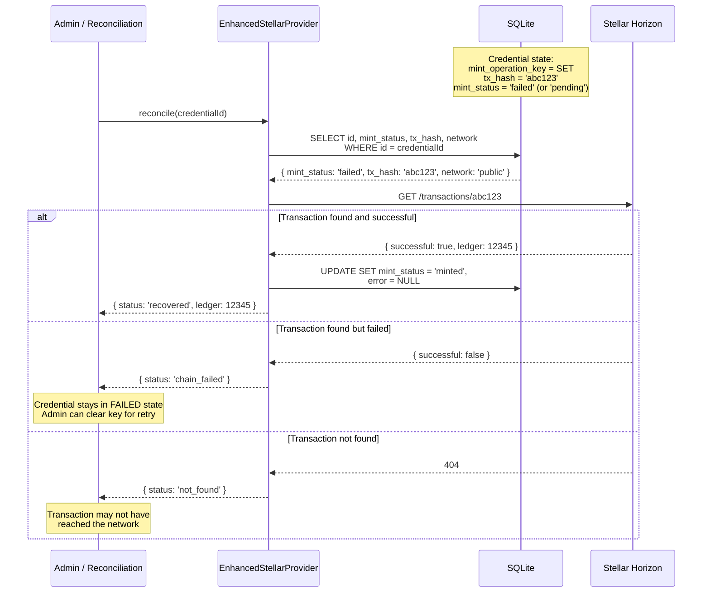
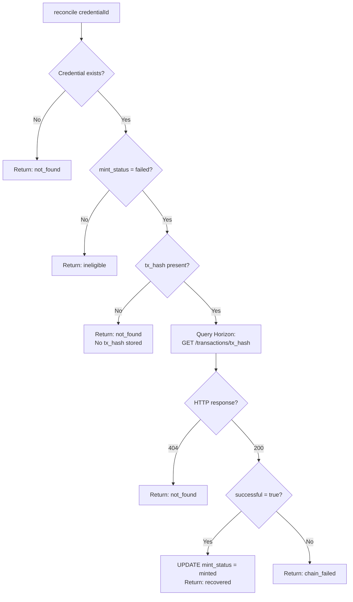

# Unknown Submission Reconciliation Diagram

- **Date:** 2026-08-20
- **Related:** `2026-08-20-reservation-state-machine-spec.md`

## Scenario: Transaction Submitted but Status Unknown

When a process submits a transaction and then crashes or loses connectivity before polling completes, the credential is left in SUBMITTED state (has tx_hash) but status is unknown. The reconciliation service checks Horizon to determine the on-chain outcome.

## Reconciliation Decision Tree

## Relationship to Pre-Submit Reservation

The pre-submit reservation reduces the likelihood of unknown submission states by:

1. Ensuring only one process reaches submission (UNIQUE key guard).
2. Persisting `tx_hash` immediately after submission (early persistence).

However, reconciliation remains necessary for:
- Process crashes between `submit()` and `tx_hash` persistence (narrow window).
- Network errors during polling (tx submitted but status unknown).
- Stellar network issues (tx submitted but not yet in Horizon).
