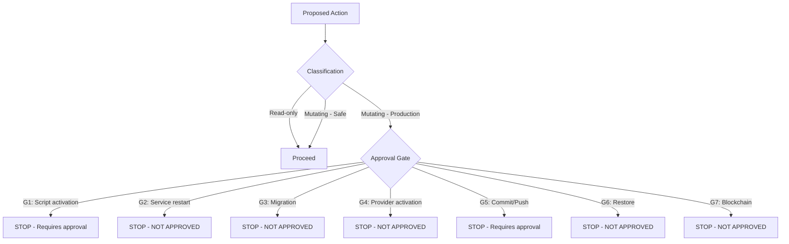

# Approval Gates

```mermaid
flowchart TD
    ACTION[Proposed Action] --> CLASS{Classification}
    CLASS -->|Read-only| ALLOW[Proceed]
    CLASS -->|Mutating - Safe| ALLOW
    CLASS -->|Mutating - Production| GATE{Approval Gate}
    GATE -->|G1: Script activation| STOP1[STOP - Requires approval]
    GATE -->|G2: Service restart| STOP2[STOP - NOT APPROVED]
    GATE -->|G3: Migration| STOP3[STOP - NOT APPROVED]
    GATE -->|G4: Provider activation| STOP4[STOP - NOT APPROVED]
    GATE -->|G5: Commit/Push| STOP5[STOP - Requires approval]
    GATE -->|G6: Restore| STOP6[STOP - NOT APPROVED]
    GATE -->|G7: Blockchain| STOP7[STOP - NOT APPROVED]
```
