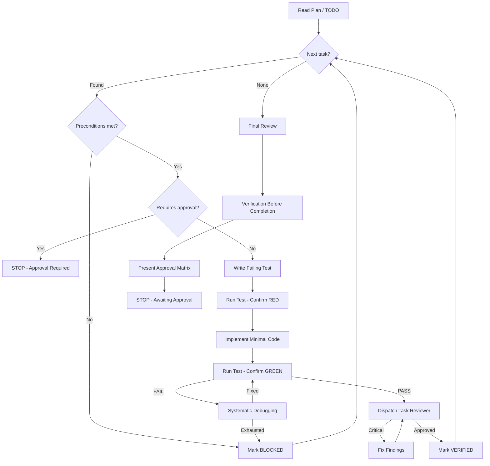

# Development Loop Flow

```mermaid
flowchart TD
    START[Read Plan / TODO] --> CHECK{Next task?}
    CHECK -->|None| FINAL[Final Review]
    CHECK -->|Found| PRE{Preconditions met?}
    PRE -->|No| BLOCKED[Mark BLOCKED]
    BLOCKED --> CHECK
    PRE -->|Yes| APPROVE{Requires approval?}
    APPROVE -->|Yes| STOP_APPROVE[STOP - Approval Required]
    APPROVE -->|No| RED[Write Failing Test]
    RED --> RUN_RED[Run Test - Confirm RED]
    RUN_RED --> IMPL[Implement Minimal Code]
    IMPL --> GREEN[Run Test - Confirm GREEN]
    GREEN -->|FAIL| DEBUG[Systematic Debugging]
    DEBUG -->|Fixed| GREEN
    DEBUG -->|Exhausted| BLOCKED
    GREEN -->|PASS| REVIEW[Dispatch Task Reviewer]
    REVIEW -->|Critical| FIX[Fix Findings]
    FIX --> REVIEW
    REVIEW -->|Approved| VERIFIED[Mark VERIFIED]
    VERIFIED --> CHECK
    FINAL --> VBC[Verification Before Completion]
    VBC --> MATRIX[Present Approval Matrix]
    MATRIX --> DONE[STOP - Awaiting Approval]
```
