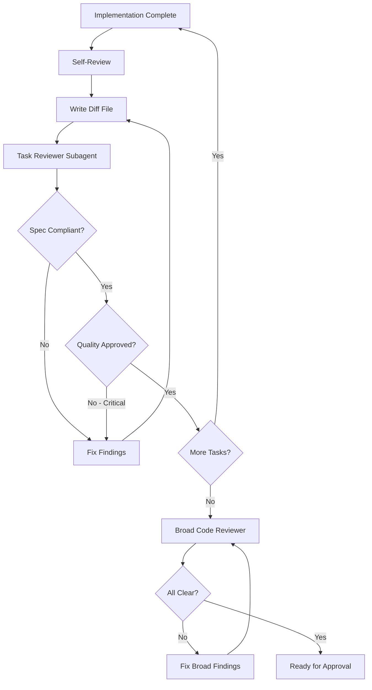

# Code Review Flow

```mermaid
flowchart TD
    IMPL[Implementation Complete] --> SELF[Self-Review]
    SELF --> DIFF[Write Diff File]
    DIFF --> TASK_REV[Task Reviewer Subagent]
    TASK_REV --> SPEC{Spec Compliant?}
    SPEC -->|No| FIX[Fix Findings]
    FIX --> DIFF
    SPEC -->|Yes| QUALITY{Quality Approved?}
    QUALITY -->|No - Critical| FIX
    QUALITY -->|Yes| NEXT{More Tasks?}
    NEXT -->|Yes| IMPL
    NEXT -->|No| BROAD[Broad Code Reviewer]
    BROAD --> FINAL{All Clear?}
    FINAL -->|No| FIX_BROAD[Fix Broad Findings]
    FIX_BROAD --> BROAD
    FINAL -->|Yes| DONE[Ready for Approval]
```
