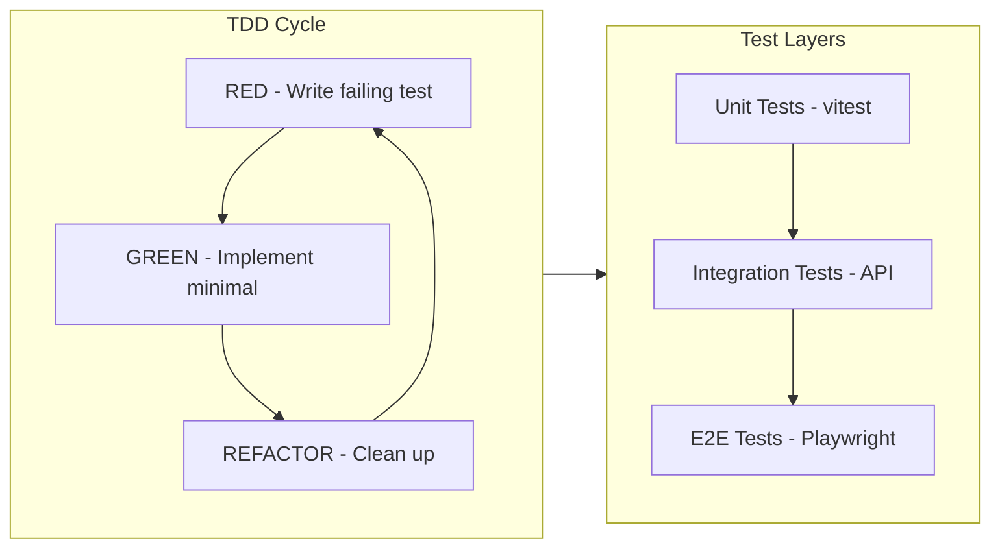

# Test Strategy Layers

```mermaid
flowchart LR
    subgraph TDD[TDD Cycle]
        R[RED - Write failing test] --> G[GREEN - Implement minimal]
        G --> RF[REFACTOR - Clean up]
        RF --> R
    end
    subgraph Layers[Test Layers]
        U[Unit Tests - vitest] --> I[Integration Tests - API]
        I --> E[E2E Tests - Playwright]
    end
    TDD --> Layers
```
