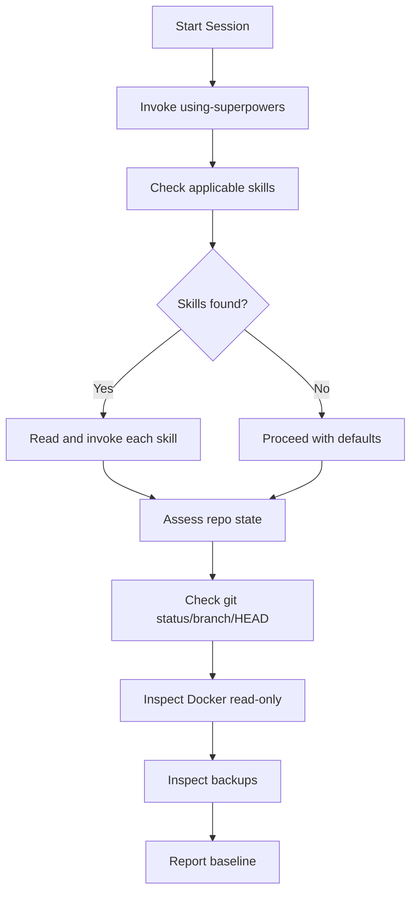

# Workflow Discovery Flow

```mermaid
flowchart TD
    A[Start Session] --> B[Invoke using-superpowers]
    B --> C[Check applicable skills]
    C --> D{Skills found?}
    D -->|Yes| E[Read and invoke each skill]
    D -->|No| F[Proceed with defaults]
    E --> G[Assess repo state]
    F --> G
    G --> H[Check git status/branch/HEAD]
    H --> I[Inspect Docker read-only]
    I --> J[Inspect backups]
    J --> K[Report baseline]
```
