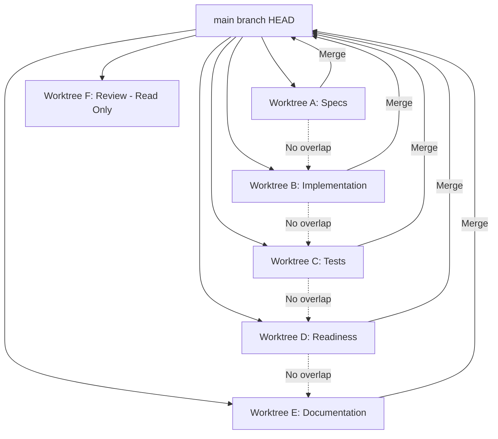

# Worktree Isolation Strategy

```mermaid
flowchart TD
    MAIN[main branch HEAD] --> WA[Worktree A: Specs]
    MAIN --> WB[Worktree B: Implementation]
    MAIN --> WC[Worktree C: Tests]
    MAIN --> WD[Worktree D: Readiness]
    MAIN --> WE[Worktree E: Documentation]
    MAIN --> WF[Worktree F: Review - Read Only]

    WA -.->|No overlap| WB
    WB -.->|No overlap| WC
    WC -.->|No overlap| WD
    WD -.->|No overlap| WE

    WA -->|Merge| MAIN
    WB -->|Merge| MAIN
    WC -->|Merge| MAIN
    WD -->|Merge| MAIN
    WE -->|Merge| MAIN
```
