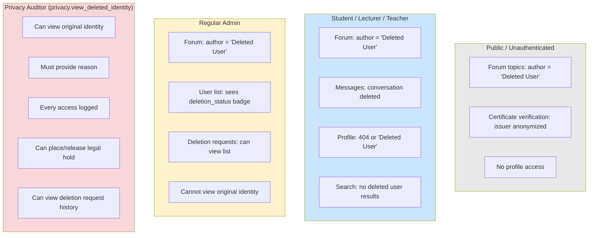
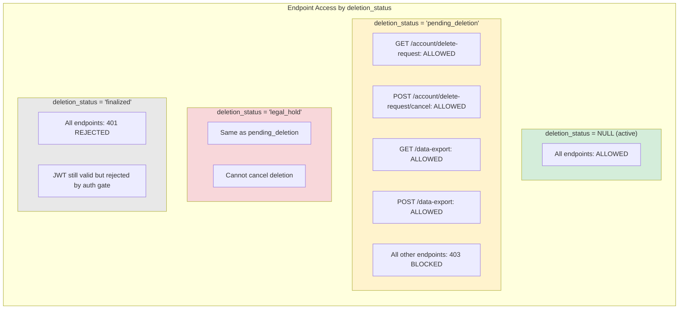
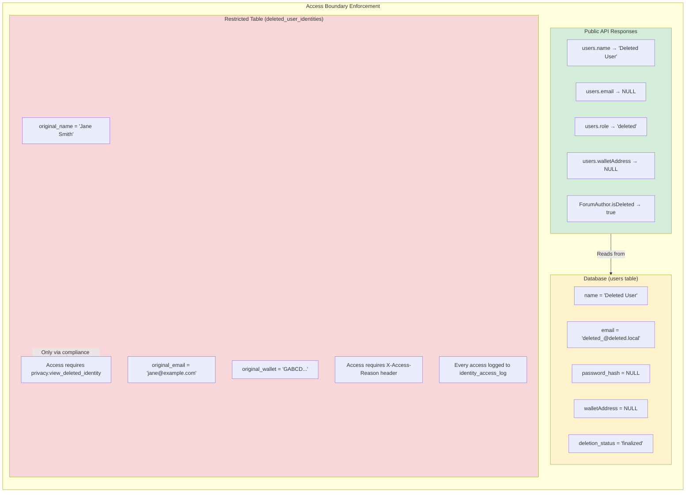

# Forum Anonymization — Access Control Diagram

**Last updated:** 2026-09-04

## 1. Identity Visibility by Role

## 2. API Access Matrix for Deleted Users

## 3. Data Access Boundaries

## 4. Audit Trail Architecture

```mermaid
graph TB
    subgraph AUDIT["Audit Trail for Account Deletion"]
        direction TB

        subgraph EVENTS["audit_log Events"]
            E1["DELETION_REQUESTED — actor=user, target=user"]
            E2["DELETION_CANCELLED — actor=user, target=user"]
            E3["LEGAL_HOLD_PLACED — actor=admin, target=user"]
            E4["LEGAL_HOLD_RELEASED — actor=admin, target=user"]
            E5["ACCOUNT_FINALIZED — actor=system, target=user"]
        end

        subgraph REQUEST_LOG["deletion_requests"]
            R1["Full lifecycle: pending→cancelled/finalized"]
            R2["dry_run_result: pre-flight check JSON"]
            R3["finalization_log: purge actions JSON"]
        end

        subgraph ACCESS_LOG["identity_access_log"]
            A1["actor_id: who accessed"]
            A2["reason: why (required)"]
            A3["fields_accessed: which fields"]
            A4["outcome: viewed/exported/denied"]
        end

        subgraph SNAPSHOT["deleted_user_identities"]
            S1["Original PII preserved"]
            S2["retention_expires_at: when to purge"]
            S3["access_count: how many times accessed"]
        end
    end

    EVENTS -->|"Records lifecycle events"| E1
    REQUEST_LOG -->|"Tracks request state"| R1
    ACCESS_LOG -->|"Tracks identity access"| A1
    SNAPSHOT -->|"Stores original PII"| S1

    style EVENTS fill:#cce5ff
    style REQUEST_LOG fill:#d4edda
    style ACCESS_LOG fill:#f8d7da
    style SNAPSHOT fill:#fff3cd
```

