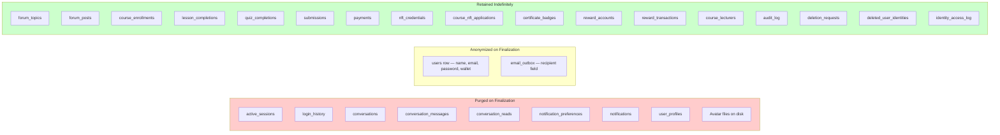

# Forum Anonymization — Data Model Diagram

**Last updated:** 2026-09-04

## User Account State & Forum Relationships

```mermaid
erDiagram
    USERS {
        text id PK
        text name "→ 'Deleted User' on finalization"
        text email "UK → random@deleted.local"
        text password_hash "→ NULL on finalization"
        text role "student|lecturer|admin"
        text walletAddress "UK → NULL on finalization"
        text wallet_linking_status "→ 'none' on finalization"
        text auth_provider "→ 'deleted' on finalization"
        text ammawallet_user_id "→ NULL on finalization"
        text description "→ NULL on finalization"
        text deletion_status "NULL|pending_deletion|finalized|legal_hold"
        text deletion_requested_at
        text deletion_finalized_at
        text deletion_requested_by
        text legal_hold_reason
        text legal_hold_placed_at
        text legal_hold_review_date
    }

    FORUM_TOPICS {
        text id PK
        text title "PRESERVED"
        text body "PRESERVED"
        text author_id FK "NOT NULL — retained, points to anonymized user"
        text course_id FK "nullable"
        text created_at
        text updated_at
    }

    FORUM_POSTS {
        text id PK
        text topic_id FK "CASCADE on topic delete"
        text body "PRESERVED"
        text author_id FK "NOT NULL — retained, points to anonymized user"
        text created_at
        text updated_at
    }

    DELETED_USER_IDENTITIES {
        text user_id PK_FK "References users(id)"
        text original_name "Restricted access only"
        text original_email "Restricted access only"
        text original_wallet_address
        text original_auth_provider
        text original_ammawallet_user_id
        text snapshot_at
        text retention_expires_at
        int access_count
        text last_accessed_at
        text last_accessed_by
        text last_access_reason
    }

    DELETION_REQUESTS {
        text id PK
        text user_id FK
        text status "pending|cancelled|finalizing|finalized|blocked_*"
        text requested_at
        text cancel_token_hash
        text grace_period_ends_at
        text finalized_at
        text cancelled_at
        text blocked_reason
        text dry_run_result "JSON pre-flight"
        text finalization_log "JSON purge log"
    }

    IDENTITY_ACCESS_LOG {
        int id PK
        text target_user_id "No FK — survives any change"
        text actor_id "No FK"
        text reason "Required"
        text fields_accessed "JSON array"
        text outcome "viewed|exported|denied"
        text created_at
    }

    AUDIT_LOG {
        int id PK
        text action "DELETION_REQUESTED|DELETION_CANCELLED|ACCOUNT_FINALIZED|LEGAL_HOLD_*"
        text actor_id "No FK — plain TEXT"
        text target_id "No FK — plain TEXT"
        text details
        text created_at
    }

    USERS ||--o{ FORUM_TOPICS : "author_id (retained)"
    USERS ||--o{ FORUM_POSTS : "author_id (retained)"
    USERS ||--o| DELETED_USER_IDENTITIES : "user_id (1:1)"
    USERS ||--o{ DELETION_REQUESTS : "user_id"
    FORUM_TOPICS ||--o{ FORUM_POSTS : "topic_id CASCADE"
    COURSES ||--o{ FORUM_TOPICS : "course_id SET NULL"
```

## Purge vs Retain Matrix


