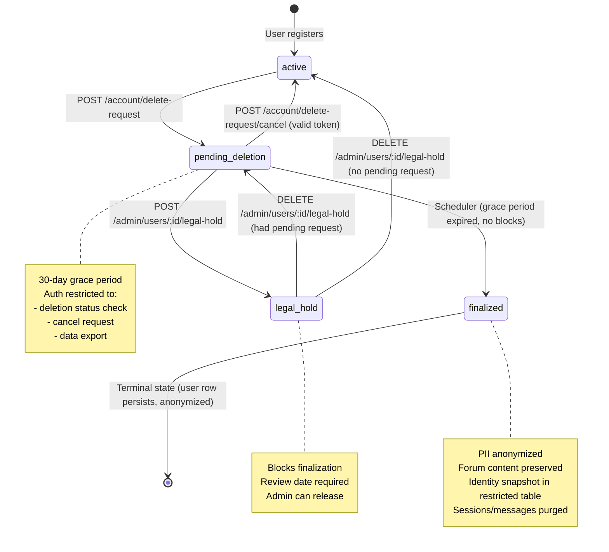
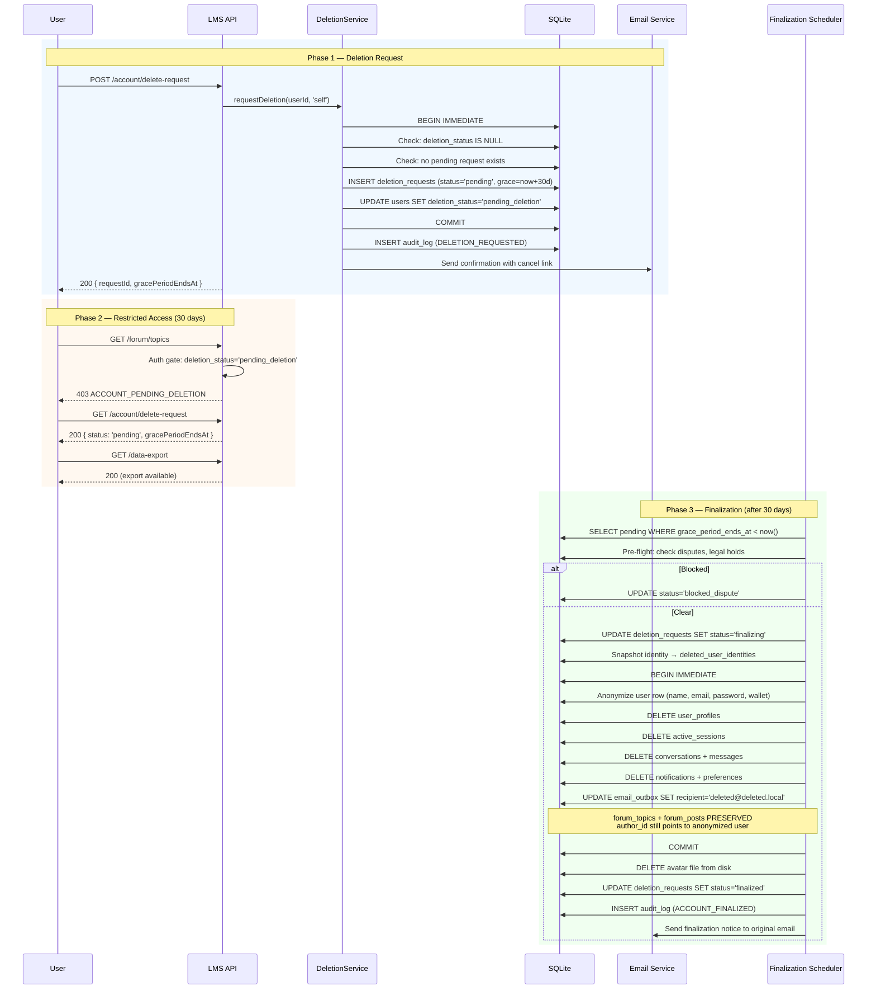
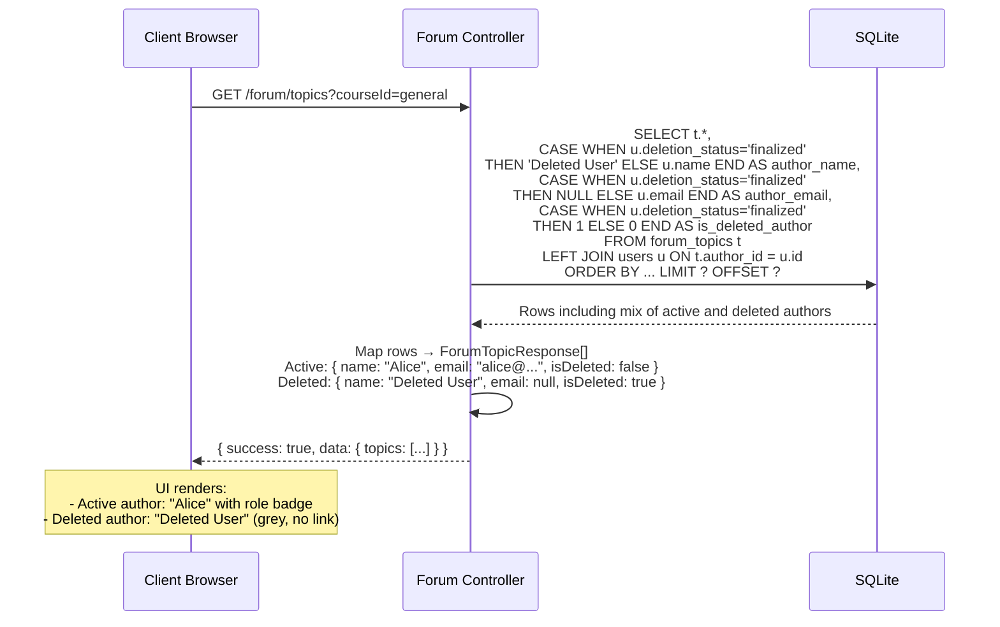
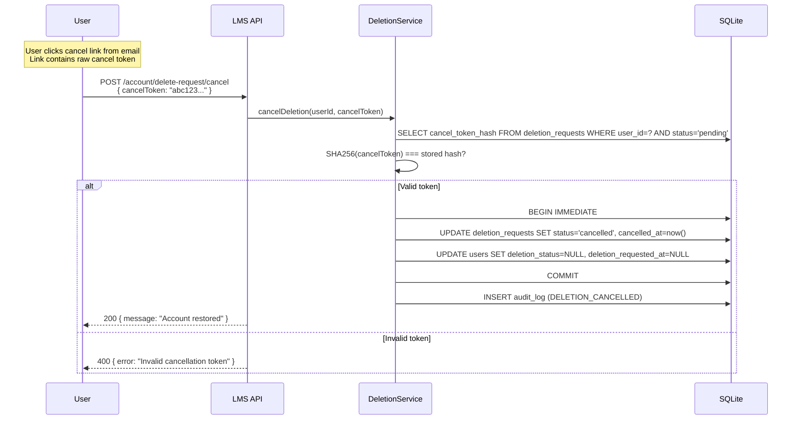
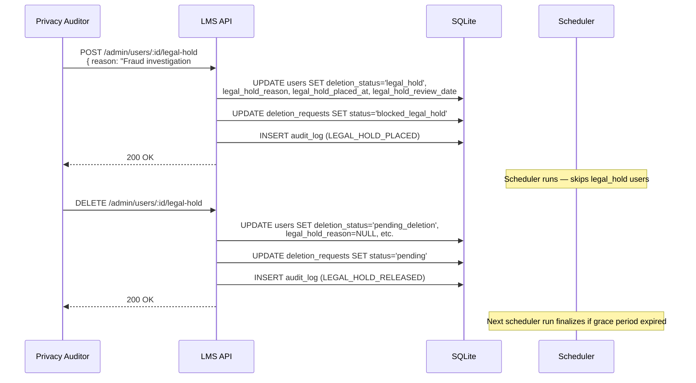

# Forum Anonymization — Flow Diagrams

**Last updated:** 2026-09-04

## 1. User Account State Transitions

## 2. Account Deletion & Anonymization Sequence

## 3. Forum Read Path — Handling Deleted Authors

## 4. Cancellation Flow

## 5. Legal Hold Flow

