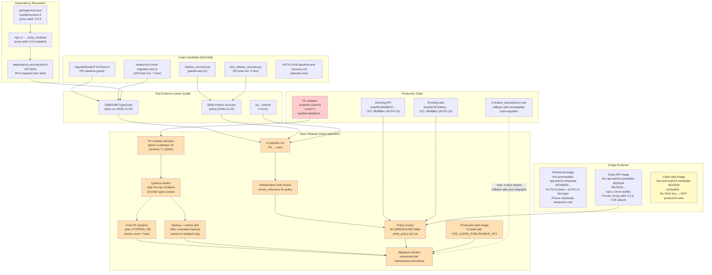
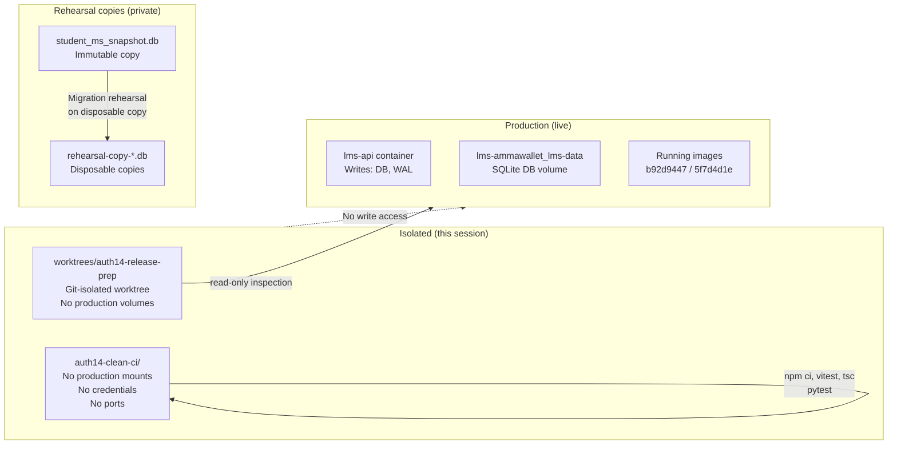

# AUTH-14 Release Dependency Flow

> Candidate: `d5191b9` on `codex/auth14-release-prep`  
> Date: 2026-11-02  
> Shows: what must be true before each gate can be passed

```mermaid
flowchart TD
    subgraph CODE["Code Candidate (d5191b9)"]
        C1["migrateRewardTxnCheck.ts\n(FK baseline guard)"]
        C2["reward-txn-check-migration.test.ts\n(105 tests incl. 7 new)"]
        C3["release_recovery.py\n(partial-stop fix)"]
        C4["test_release_recovery.py\n(50 tests incl. 5 new)"]
        C5["AUTH-14-fk-baseline-and-recovery.md\n(operator doc)"]
    end

    subgraph DEPS["Dependency Resolution"]
        D1["package-lock.json\nlockfileVersion=3\nproxy-addr: 2.0.8"]
        D2["npm ci → node_modules\nproxy-addr 2.0.8 installed"]
        D3["dependency-security.test.ts\n3/3 PASS\nIPv4-mapped trust: false"]
    end

    subgraph TEST["Test Evidence (clean install)"]
        T1["2288/2288 TypeScript\nvitest run (2026-11-02)"]
        T2["50/50 Python recovery\npytest (2026-11-02)"]
        T3["tsc --noEmit\n0 errors"]
    end

    subgraph IMAGE["Image Evidence"]
        I1["Rehearsal image\nlms-ammawallet-api:auth14-rehearsal\n847d9340...\nAUTH-13 base + AUTH-14 dist layer\nProves: bootstrap behaviour only"]
        I2["Clean API image\nlms-api:auth14-candidate-d5191b9\nf9e76c2e...\nnpm ci from lockfile\nProves: proxy-addr 2.0.8, CVE absent"]
        I3["Clean web image\nlms-web:auth14-candidate-d5191b9\na216a4b5...\nNo Clerk key — NOT production web"]
    end

    subgraph PROD["Production State"]
        P1["Running API\nsha256:b92d9447...\nOCI: dfb988ec (AUTH-13)"]
        P2["Running web\nsha256:5f7d4d1e...\nOCI: dfb988ec (AUTH-13)"]
        P3["FK violation\nstudents rowid=8\ncount=1\nsha256=feb85f1d..."]
        P4["0 reward_transactions rows\nrollback safe immediately post-migration"]
    end

    subgraph GATES["Open Release Gates (operator)"]
        G1["CI pipeline run\nPR → main"]
        G2["Independent code review\nreview_reference for policy"]
        G3["FK violation decision\nOption A (delete) / B (restore) / C (defer)"]
        G4["Quiesce writers\nstop lms-api container\n(9 writer types cease)"]
        G5["Final FK baseline\n--plan STOPPED_DB\nreview count + hash"]
        G6["Backup + restore drill\nWAL-consistent backup\nrestore to isolated copy"]
        G7["Production web image\nCI build with VITE_CLERK_PUBLISHABLE_KEY"]
        G8["Policy review\nfill UNRESOLVED fields\nverify_policy dry run"]
        G9["Migration window\nsequenced per maintenance procedure"]
    end

    C1 --> T1
    C2 --> T1
    C3 --> T2
    C4 --> T2
    D1 --> D2
    D2 --> D3
    D3 --> T1
    T1 --> G1
    T2 --> G1
    T3 --> G1
    G1 --> G2
    G2 --> G8
    P1 --> G8
    P2 --> G8
    P3 --> G3
    G3 --> G4
    G4 --> G5
    G5 --> G9
    G6 --> G9
    G8 --> G9
    G4 --> G6
    G7 --> G9
    I2 --> G8
    P4 -.->|"note: 0 rows means\nrollback safe post-migration"| G9

    style G1 fill:#ffe0b2
    style G2 fill:#ffe0b2
    style G3 fill:#ffe0b2
    style G4 fill:#ffe0b2
    style G5 fill:#ffe0b2
    style G6 fill:#ffe0b2
    style G7 fill:#ffe0b2
    style G8 fill:#ffe0b2
    style G9 fill:#ffe0b2
    style I3 fill:#fff9c4
    style P3 fill:#ffcccc
```

## Trust Boundaries

```mermaid
flowchart LR
    subgraph ISOLATED["Isolated (this session)"]
        A["auth14-clean-ci/\nNo production mounts\nNo credentials\nNo ports"]
        B["worktrees/auth14-release-prep\nGit-isolated worktree\nNo production volumes"]
    end

    subgraph PRODUCTION["Production (live)"]
        C["lms-api container\nWrites: DB, WAL"]
        D["lms-ammawallet_lms-data\nSQLite DB volume"]
        E["Running images\nb92d9447 / 5f7d4d1e"]
    end

    subgraph REHEARSAL["Rehearsal copies (private)"]
        F["student_ms_snapshot.db\nImmutable copy"]
        G["rehearsal-copy-*.db\nDisposable copies"]
    end

    A -- "npm ci, vitest, tsc\npytest" --> A
    B -- "read-only inspection" --> PRODUCTION
    F -- "Migration rehearsal\non disposable copy" --> G
    ISOLATED -. "No write access" .-> PRODUCTION
```
