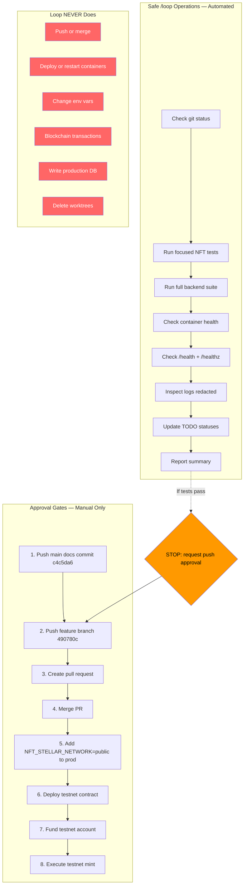

# Approval Gates and Loop Plan

```mermaid
flowchart TD
    subgraph SafeLoop["Safe /loop Operations — Automated"]
        L1["Check git status"] --> L2["Run focused NFT tests"]
        L2 --> L3["Run full backend suite"]
        L3 --> L4["Check container health"]
        L4 --> L5["Check /health + /healthz"]
        L5 --> L6["Inspect logs redacted"]
        L6 --> L7["Update TODO statuses"]
        L7 --> L8["Report summary"]
    end

    subgraph ApprovalGates["Approval Gates — Manual Only"]
        G1["1. Push main docs commit c4c5da6"]
        G2["2. Push feature branch 490780c"]
        G3["3. Create pull request"]
        G4["4. Merge PR"]
        G5["5. Add NFT_STELLAR_NETWORK=public to prod"]
        G6["6. Deploy testnet contract"]
        G7["7. Fund testnet account"]
        G8["8. Execute testnet mint"]
        G1 --> G2 --> G3 --> G4 --> G5 --> G6 --> G7 --> G8
    end

    L8 -.->|"If tests pass"| STOP1{"STOP: request push approval"}
    STOP1 --> G2

    subgraph NeverDo["Loop NEVER Does"]
        X1["Push or merge"]
        X2["Deploy or restart containers"]
        X3["Change env vars"]
        X4["Blockchain transactions"]
        X5["Write production DB"]
        X6["Delete worktrees"]
    end

    style X1 fill:#f66,color:#fff
    style X2 fill:#f66,color:#fff
    style X3 fill:#f66,color:#fff
    style X4 fill:#f66,color:#fff
    style X5 fill:#f66,color:#fff
    style X6 fill:#f66,color:#fff
    style STOP1 fill:#f90,color:#000
```
