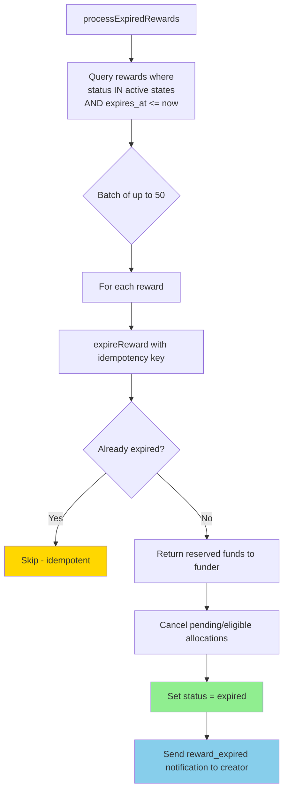

# Automatic Expiry Flow

## Key Properties
- **Bounded**: Max 50 rewards per tick
- **Idempotent**: Uses `auto-expire-{rewardId}` idempotency key
- **Independent**: Failure to expire one reward doesn't block others
- **Notifying**: Creator receives `reward_expired` notification
