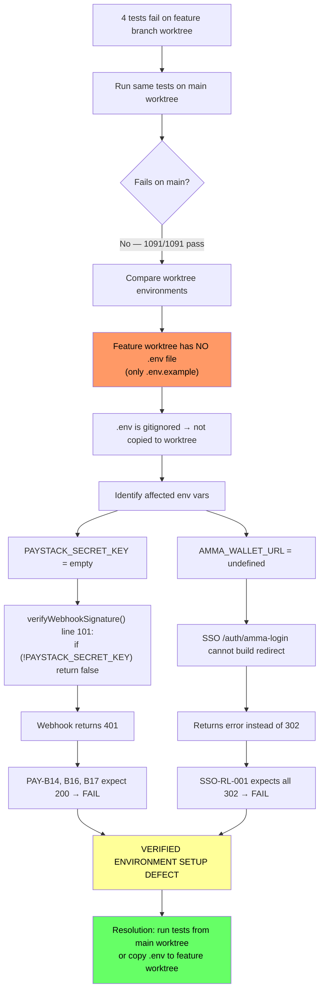

# Backend Failing Test Debug Flow

```mermaid
flowchart TD
    A[4 tests fail on feature branch worktree] --> B[Run same tests on main worktree]
    B --> C{Fails on main?}
    C -->|No — 1091/1091 pass| D[Compare worktree environments]
    D --> E["Feature worktree has NO .env file<br/>(only .env.example)"]
    E --> F[".env is gitignored → not copied to worktree"]
    F --> G[Identify affected env vars]

    G --> H["PAYSTACK_SECRET_KEY = empty"]
    H --> I["verifyWebhookSignature() line 101:<br/>if (!PAYSTACK_SECRET_KEY) return false"]
    I --> J[Webhook returns 401]
    J --> K["PAY-B14, B16, B17 expect 200 → FAIL"]

    G --> L["AMMA_WALLET_URL = undefined"]
    L --> M["SSO /auth/amma-login cannot build redirect"]
    M --> N["Returns error instead of 302"]
    N --> O["SSO-RL-001 expects all 302 → FAIL"]

    K --> P["VERIFIED ENVIRONMENT SETUP DEFECT"]
    O --> P
    P --> Q["Resolution: run tests from main worktree<br/>or copy .env to feature worktree"]

    style P fill:#ff9,color:#000
    style Q fill:#6f6,color:#000
    style E fill:#f96,color:#000
```
