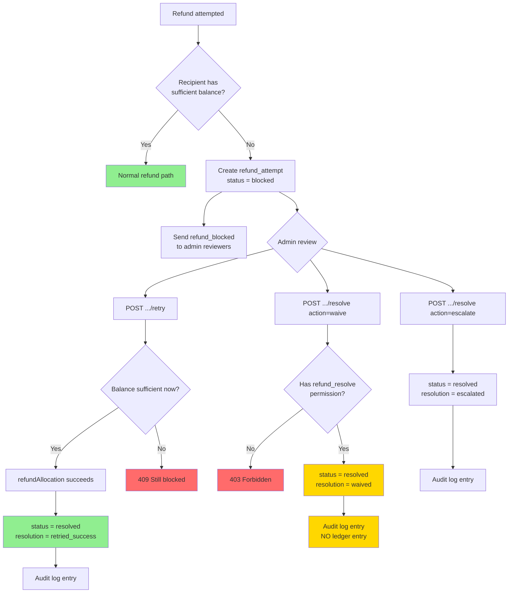

# Blocked Refund Resolution Flow

## State Transitions
- `blocked` → `resolved` (resolution: `retried_success`) — funds actually moved
- `blocked` → `resolved` (resolution: `waived`) — no balance change, audit-only
- `blocked` → `resolved` (resolution: `escalated`) — flagged for higher review

## Permission Matrix
| Action | admin | admin-2 | super-admin |
|--------|-------|---------|-------------|
| List | reward.refund_review | Yes | Yes |
| Retry | reward.refund | Yes | Yes |
| Waive | No (403) | reward.refund_resolve | Yes |
| Escalate | reward.refund_review | Yes | Yes |
