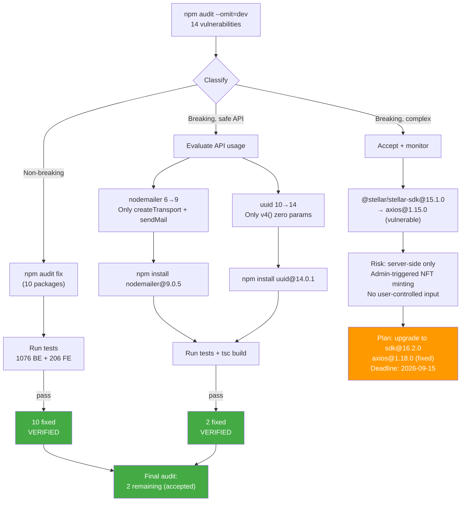

# Dependency Remediation Flow

```mermaid
graph TD
    AUDIT["npm audit --omit=dev<br/>14 vulnerabilities"] --> CLASSIFY{"Classify"}

    CLASSIFY -->|"Non-breaking"| SAFE["npm audit fix<br/>(10 packages)"]
    CLASSIFY -->|"Breaking, safe API"| EVALUATE["Evaluate API usage"]
    CLASSIFY -->|"Breaking, complex"| ACCEPT["Accept + monitor"]

    SAFE --> VERIFY_SAFE["Run tests<br/>1076 BE + 206 FE"]
    VERIFY_SAFE -->|pass| SAFE_DONE["10 fixed<br/>VERIFIED"]

    EVALUATE --> NODEMAILER["nodemailer 6→9<br/>Only createTransport + sendMail"]
    EVALUATE --> UUID["uuid 10→14<br/>Only v4() zero params"]
    NODEMAILER --> UPGRADE_NM["npm install nodemailer@9.0.5"]
    UUID --> UPGRADE_UUID["npm install uuid@14.0.1"]
    UPGRADE_NM --> VERIFY_BREAK["Run tests + tsc build"]
    UPGRADE_UUID --> VERIFY_BREAK
    VERIFY_BREAK -->|pass| BREAK_DONE["2 fixed<br/>VERIFIED"]

    ACCEPT --> STELLAR["@stellar/stellar-sdk@15.1.0<br/>→ axios@1.15.0 (vulnerable)"]
    STELLAR --> RISK["Risk: server-side only<br/>Admin-triggered NFT minting<br/>No user-controlled input"]
    RISK --> PLAN["Plan: upgrade to sdk@16.2.0<br/>axios@1.18.0 (fixed)<br/>Deadline: 2026-09-15"]

    SAFE_DONE --> FINAL["Final audit:<br/>2 remaining (accepted)"]
    BREAK_DONE --> FINAL

    style SAFE_DONE fill:#4a4,color:#fff
    style BREAK_DONE fill:#4a4,color:#fff
    style PLAN fill:#f90,color:#fff
    style FINAL fill:#4a4,color:#fff
```
