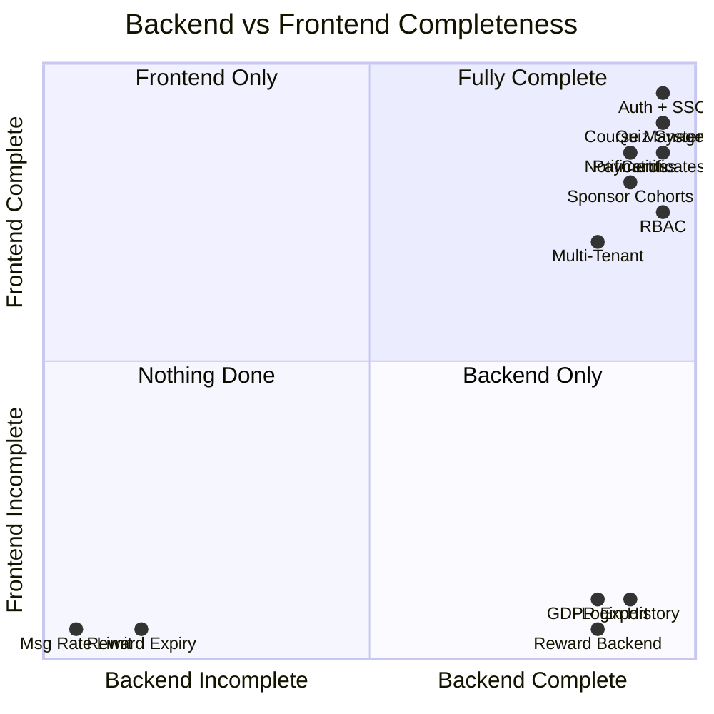

# Feature Completeness Matrix

```mermaid
quadrantChart
    title Backend vs Frontend Completeness
    x-axis "Backend Incomplete" --> "Backend Complete"
    y-axis "Frontend Incomplete" --> "Frontend Complete"

    quadrant-1 "Fully Complete"
    quadrant-2 "Frontend Only"
    quadrant-3 "Nothing Done"
    quadrant-4 "Backend Only"

    Auth + SSO: [0.95, 0.95]
    Course Management: [0.95, 0.90]
    Quiz System: [0.95, 0.90]
    Certificates: [0.95, 0.85]
    Payments: [0.90, 0.85]
    RBAC: [0.95, 0.75]
    Notifications: [0.90, 0.85]
    Sponsor Cohorts: [0.90, 0.80]
    Multi-Tenant: [0.85, 0.70]
    Reward Backend: [0.85, 0.05]
    Login History: [0.90, 0.10]
    GDPR Export: [0.85, 0.10]
    Msg Rate Limit: [0.05, 0.05]
    Reward Expiry: [0.15, 0.05]
```
