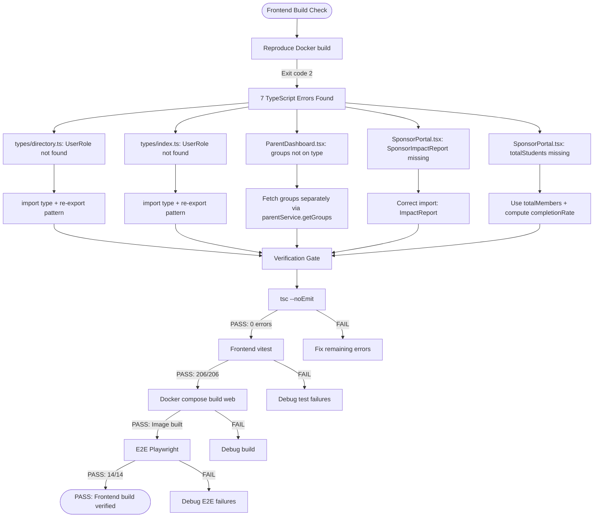

# Frontend Build Verification Flow

## Results (2026-08-15)

| Step | Status |
|------|--------|
| TypeScript check | PASS (0 errors) |
| Frontend tests | PASS (206/206) |
| Docker build | PASS |
| E2E tests | PASS (14/14) |
