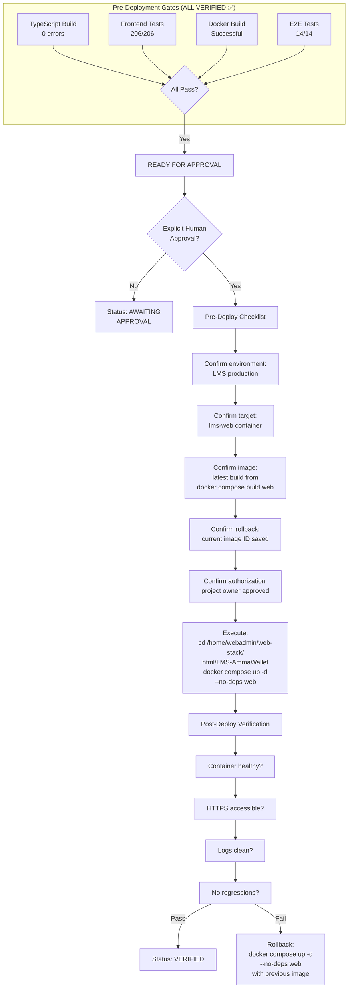

# Frontend Redeploy Approval Flow

Date: 2026-08-15 | Status: READY — AWAITING EXPLICIT APPROVAL

```mermaid
flowchart TD
    subgraph "Pre-Deployment Gates (ALL VERIFIED ✅)"
        A[TypeScript Build<br/>0 errors] --> E{All Pass?}
        B[Frontend Tests<br/>206/206] --> E
        C[Docker Build<br/>Successful] --> E
        D[E2E Tests<br/>14/14] --> E
    end

    E -->|Yes| F[READY FOR APPROVAL]

    F --> G{Explicit Human<br/>Approval?}
    G -->|No| H[Status: AWAITING<br/>APPROVAL]

    G -->|Yes| I[Pre-Deploy Checklist]
    I --> I1[Confirm environment:<br/>LMS production]
    I1 --> I2[Confirm target:<br/>lms-web container]
    I2 --> I3[Confirm image:<br/>latest build from<br/>docker compose build web]
    I3 --> I4[Confirm rollback:<br/>current image ID saved]
    I4 --> I5[Confirm authorization:<br/>project owner approved]

    I5 --> J[Execute:<br/>cd /home/webadmin/web-stack/<br/>html/LMS-AmmaWallet<br/>docker compose up -d<br/>--no-deps web]

    J --> K[Post-Deploy Verification]
    K --> K1[Container healthy?]
    K1 --> K2[HTTPS accessible?]
    K2 --> K3[Logs clean?]
    K3 --> K4[No regressions?]

    K4 -->|Pass| L[Status: VERIFIED]
    K4 -->|Fail| M[Rollback:<br/>docker compose up -d<br/>--no-deps web<br/>with previous image]
```
