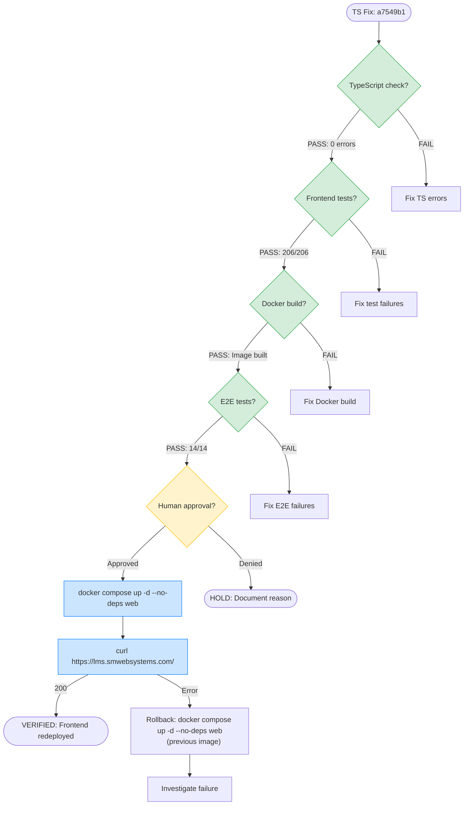

# Frontend Redeploy Flow

## Current Status

| Gate | Status |
|------|--------|
| TypeScript check | VERIFIED |
| Frontend tests (206/206) | VERIFIED |
| Docker build | VERIFIED |
| E2E tests (14/14) | VERIFIED |
| Human approval | PENDING |
| Redeploy | AWAITING APPROVAL |
| HTTPS verification | NOT STARTED |
