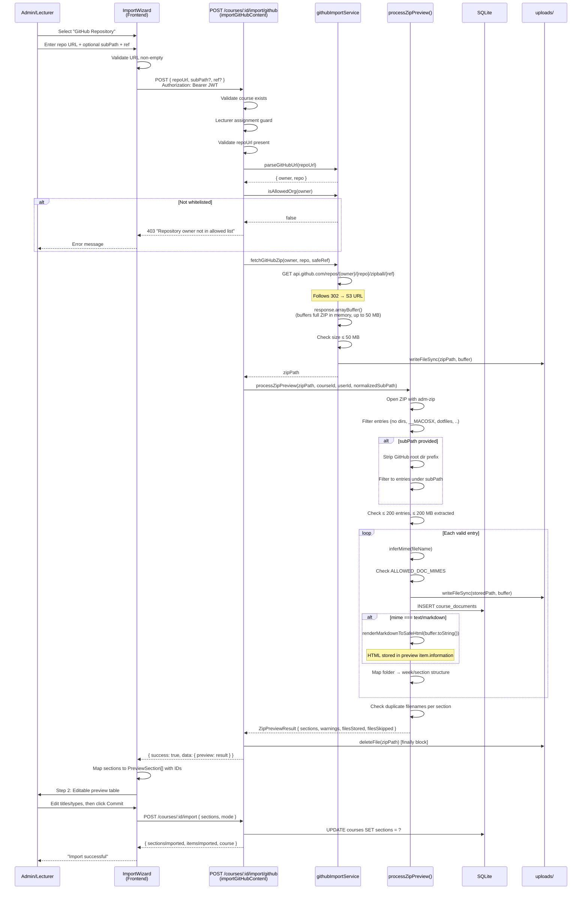

# GitHub Import — Current Flow

## Security Layers

1. **JWT auth** — `authenticate` middleware
2. **RBAC** — `requirePermission('course.manage')`
3. **Lecturer guard** — checks `course_lecturers` table
4. **Org whitelist** — only `SM-Web-Systems` by default (env override)
5. **URL validation** — hostname must be `github.com`
6. **SSRF prevention** — `encodeURIComponent` on path segments
7. **ZIP bomb protection** — 50 MB download, 200 entries, 200 MB extracted
8. **Path traversal** — no `..`, no dotfiles, UUID-based storage names
9. **Temp cleanup** — `finally` block deletes downloaded ZIP
