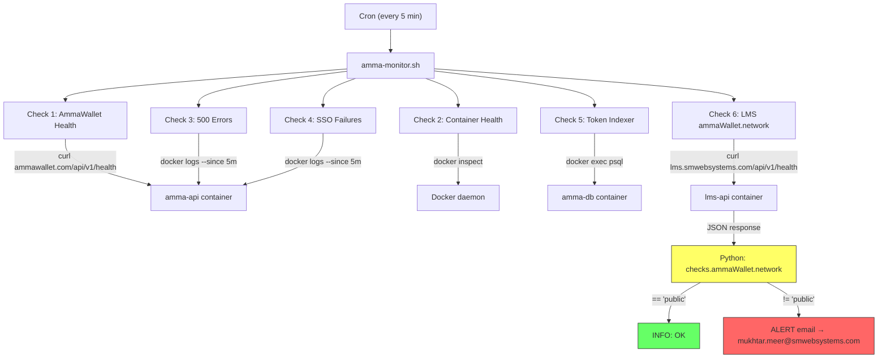

# Health Check Monitor Flow

## Failure Point (2026-08-11 Incident)

The failure occurred at the **EXTRACT** node. The Python extraction used the old JSON path
(`d.ammaWallet.network`) instead of the new path (`d.checks.ammaWallet.network`),
returning `MISSING` instead of `public`.

The LMS API and all services were healthy throughout — this was a **monitor bug**, not a service outage.
