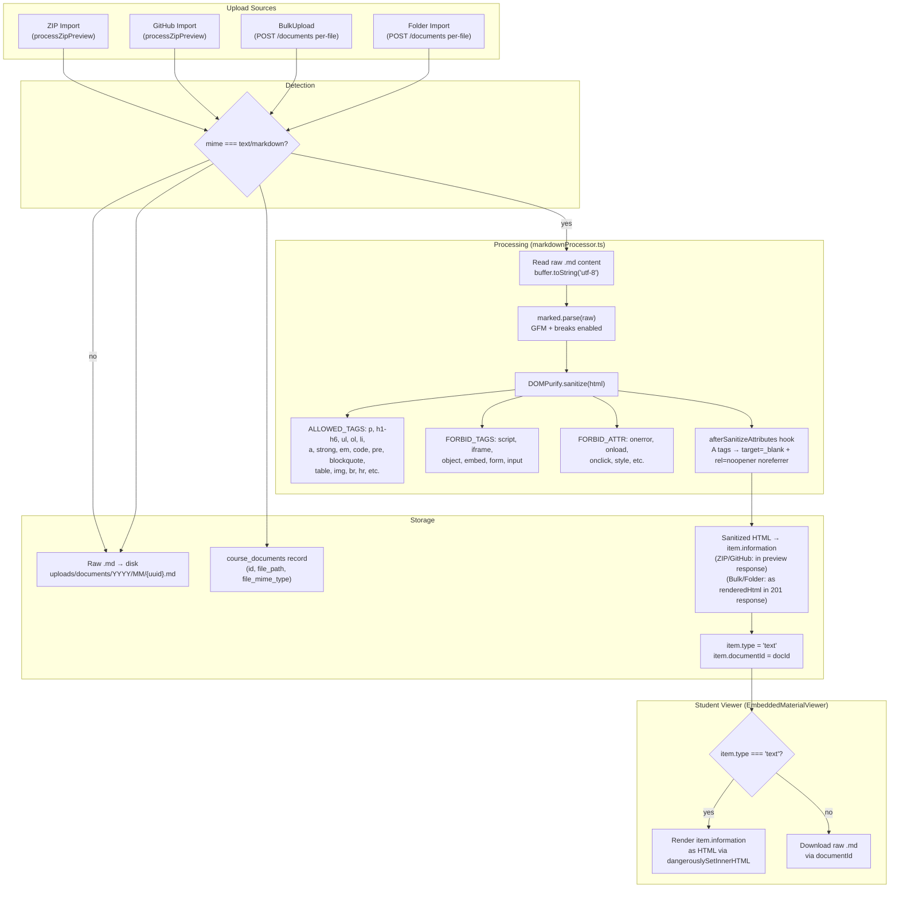

# Markdown Processing Pipeline

> Updated 2026-08-12 — all four upload paths now render markdown. DOMPurify hook is active.

## Current State

| Component | Status |
|-----------|--------|
| `marked` parsing (GFM) | ✅ Working |
| DOMPurify sanitization | ✅ Working |
| `<script>` stripping | ✅ Tested (UPLOAD-EXT-3) |
| `onerror` stripping | ✅ Tested (UPLOAD-EXT-3) |
| `<iframe>` stripping | ✅ Tested (UPLOAD-EXT-3) |
| `style` attr stripping | ✅ Tested (UPLOAD-EXT-3) |
| `afterSanitizeAttributes` hook | ✅ Active (SANITIZE-LINK-1/2) |
| ZIP/GitHub rendering | ✅ Working |
| BulkUpload rendering | ✅ Working (via `createDocument` renderedHtml) |
| Folder upload rendering | ✅ Working (via `createDocument` renderedHtml) |

## Rendering Paths

- **ZIP/GitHub:** `processZipPreview()` calls `renderMarkdownToSafeHtml()` inline, stores HTML in `preview.item.information`
- **BulkUpload/Folder:** `createDocument()` handler detects `text/markdown` MIME, calls `renderMarkdownToSafeHtml()`, returns `renderedHtml` in 201 response. Frontend reads it and passes as `information` to course item.
