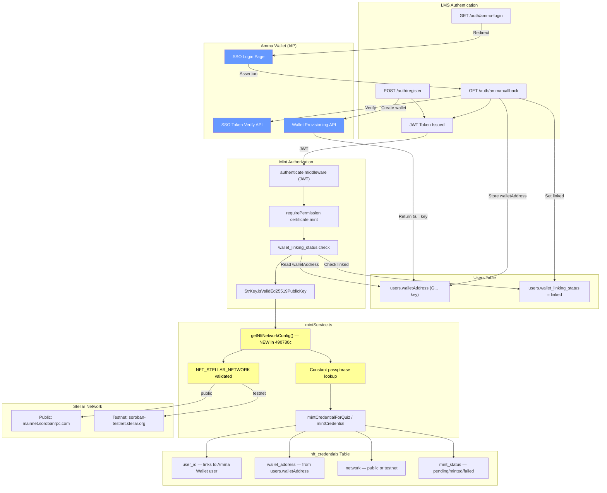

# NFT Amma Wallet Integration Flow

## Legend

- **Blue (Amma Wallet):** External IdP — unchanged by 490780c
- **Yellow (mintService):** Modified by 490780c — network config extraction only
- **All other components:** Unchanged — SSO, auth, wallet address, authorization preserved
