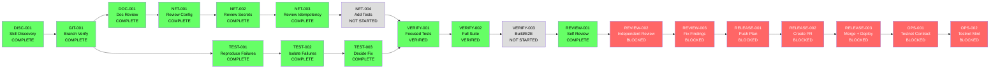

# NFT Review Dependency Map

```mermaid
flowchart LR
    DISC001["DISC-001\nSkill Discovery\nCOMPLETE"] --> GIT001["GIT-001\nBranch Verify\nCOMPLETE"]
    GIT001 --> DOC001["DOC-001\nDoc Review\nCOMPLETE"]
    GIT001 --> TEST001["TEST-001\nReproduce Failures\nCOMPLETE"]

    TEST001 --> TEST002["TEST-002\nIsolate Failures\nCOMPLETE"]
    TEST002 --> TEST003["TEST-003\nDecide Fix\nCOMPLETE"]

    DOC001 --> NFT001["NFT-001\nReview Config\nCOMPLETE"]
    NFT001 --> NFT002["NFT-002\nReview Secrets\nCOMPLETE"]
    NFT002 --> NFT003["NFT-003\nReview Idempotency\nCOMPLETE"]
    NFT003 --> NFT004["NFT-004\nAdd Tests\nNOT STARTED"]

    NFT004 --> VERIFY001["VERIFY-001\nFocused Tests\nVERIFIED"]
    TEST003 --> VERIFY001
    VERIFY001 --> VERIFY002["VERIFY-002\nFull Suite\nVERIFIED"]
    VERIFY002 --> VERIFY003["VERIFY-003\nBuild/E2E\nNOT STARTED"]

    VERIFY003 --> REVIEW001["REVIEW-001\nSelf Review\nCOMPLETE"]
    REVIEW001 --> REVIEW002["REVIEW-002\nIndependent Review\nBLOCKED"]
    REVIEW002 --> REVIEW003["REVIEW-003\nFix Findings\nBLOCKED"]

    REVIEW003 --> RELEASE001["RELEASE-001\nPush Plan\nBLOCKED"]
    RELEASE001 --> RELEASE002["RELEASE-002\nCreate PR\nBLOCKED"]
    RELEASE002 --> RELEASE003["RELEASE-003\nMerge + Deploy\nBLOCKED"]

    RELEASE003 --> OPS001["OPS-001\nTestnet Contract\nBLOCKED"]
    OPS001 --> OPS002["OPS-002\nTestnet Mint\nBLOCKED"]

    classDef complete fill:#6f6,color:#000
    classDef inprog fill:#ff9,color:#000
    classDef blocked fill:#f66,color:#fff
    classDef notstarted fill:#ddd,color:#000

    class DISC001,GIT001,DOC001,TEST001,TEST002,TEST003,NFT001,NFT002,NFT003,VERIFY001,VERIFY002,REVIEW001 complete
    class NFT004,VERIFY003 notstarted
    class REVIEW002,REVIEW003,RELEASE001,RELEASE002,RELEASE003,OPS001,OPS002 blocked
```
