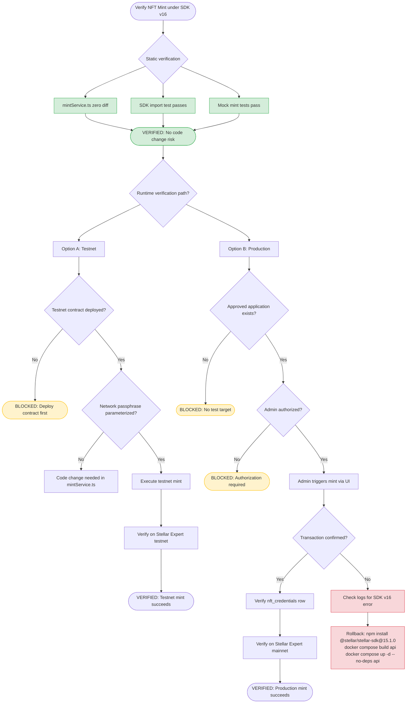

# NFT Mint Verification Flow — SDK v16

## Current Status: Static VERIFIED, Runtime BLOCKED

| Check | Status |
|-------|--------|
| mintService.ts unchanged | VERIFIED |
| SDK v16 imports valid | VERIFIED |
| Mock mint tests pass | VERIFIED |
| Testnet contract | BLOCKED (not deployed) |
| Production mint | BLOCKED (no authorized target) |
