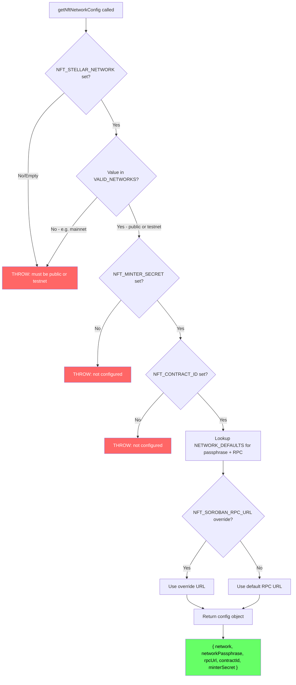

# NFT Network Configuration Flow

```mermaid
flowchart TD
    A[getNftNetworkConfig called] --> B{NFT_STELLAR_NETWORK set?}
    B -->|No/Empty| C[THROW: must be public or testnet]
    B -->|Yes| D{Value in VALID_NETWORKS?}
    D -->|No - e.g. mainnet| C
    D -->|Yes - public or testnet| E{NFT_MINTER_SECRET set?}
    E -->|No| F[THROW: not configured]
    E -->|Yes| G{NFT_CONTRACT_ID set?}
    G -->|No| H[THROW: not configured]
    G -->|Yes| I[Lookup NETWORK_DEFAULTS for passphrase + RPC]
    I --> J{NFT_SOROBAN_RPC_URL override?}
    J -->|Yes| K[Use override URL]
    J -->|No| L[Use default RPC URL]
    K --> M[Return config object]
    L --> M
    M --> N["{ network, networkPassphrase, rpcUrl, contractId, minterSecret }"]

    style C fill:#f66,color:#fff
    style F fill:#f66,color:#fff
    style H fill:#f66,color:#fff
    style N fill:#6f6,color:#000
```
