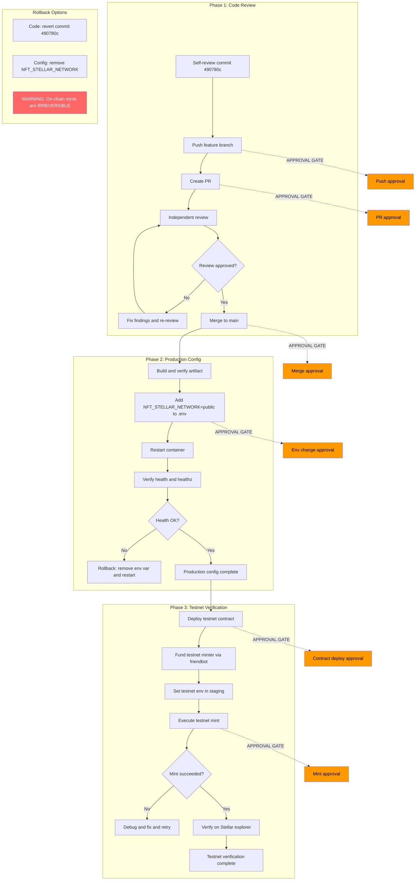

# NFT Release, Deployment, and Rollback Flow

```mermaid
flowchart TD
    subgraph Phase1["Phase 1: Code Review"]
        A1["Self-review commit 490780c"] --> A2["Push feature branch"]
        A2 --> A3["Create PR"]
        A3 --> A4["Independent review"]
        A4 --> A5{"Review approved?"}
        A5 -->|No| A6["Fix findings and re-review"]
        A6 --> A4
        A5 -->|Yes| A7["Merge to main"]
    end

    subgraph Phase2["Phase 2: Production Config"]
        A7 --> B1["Build and verify artifact"]
        B1 --> B2["Add NFT_STELLAR_NETWORK=public to .env"]
        B2 --> B3["Restart container"]
        B3 --> B4["Verify health and healthz"]
        B4 --> B5{"Health OK?"}
        B5 -->|No| B6["Rollback: remove env var and restart"]
        B5 -->|Yes| B7["Production config complete"]
    end

    subgraph Phase3["Phase 3: Testnet Verification"]
        B7 --> C1["Deploy testnet contract"]
        C1 --> C2["Fund testnet minter via friendbot"]
        C2 --> C3["Set testnet env in staging"]
        C3 --> C4["Execute testnet mint"]
        C4 --> C5{"Mint succeeded?"}
        C5 -->|No| C6["Debug and fix and retry"]
        C5 -->|Yes| C7["Verify on Stellar explorer"]
        C7 --> C8["Testnet verification complete"]
    end

    subgraph Rollback["Rollback Options"]
        R1["Code: revert commit 490780c"]
        R2["Config: remove NFT_STELLAR_NETWORK"]
        R3["WARNING: On-chain mints are IRREVERSIBLE"]
    end

    A2 -.->|APPROVAL GATE| AG1["Push approval"]
    A3 -.->|APPROVAL GATE| AG2["PR approval"]
    A7 -.->|APPROVAL GATE| AG3["Merge approval"]
    B2 -.->|APPROVAL GATE| AG4["Env change approval"]
    C1 -.->|APPROVAL GATE| AG5["Contract deploy approval"]
    C4 -.->|APPROVAL GATE| AG6["Mint approval"]

    style AG1 fill:#f90,color:#000
    style AG2 fill:#f90,color:#000
    style AG3 fill:#f90,color:#000
    style AG4 fill:#f90,color:#000
    style AG5 fill:#f90,color:#000
    style AG6 fill:#f90,color:#000
    style R3 fill:#f66,color:#fff
```
