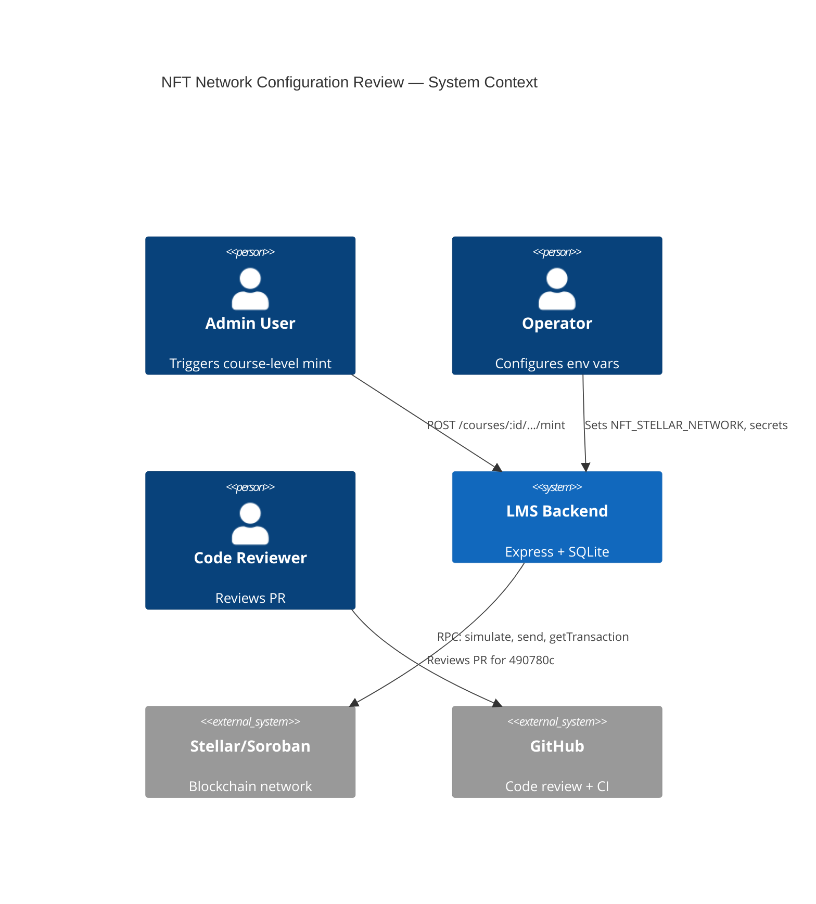

# NFT Review Context Diagram

```mermaid
C4Context
    title NFT Network Configuration Review — System Context

    Person(admin, "Admin User", "Triggers course-level mint")
    Person(operator, "Operator", "Configures env vars")
    Person(reviewer, "Code Reviewer", "Reviews PR")

    System(lms, "LMS Backend", "Express + SQLite")
    System_Ext(stellar, "Stellar/Soroban", "Blockchain network")
    System_Ext(github, "GitHub", "Code review + CI")

    Rel(admin, lms, "POST /courses/:id/.../mint")
    Rel(operator, lms, "Sets NFT_STELLAR_NETWORK, secrets")
    Rel(lms, stellar, "RPC: simulate, send, getTransaction")
    Rel(reviewer, github, "Reviews PR for 490780c")
```
