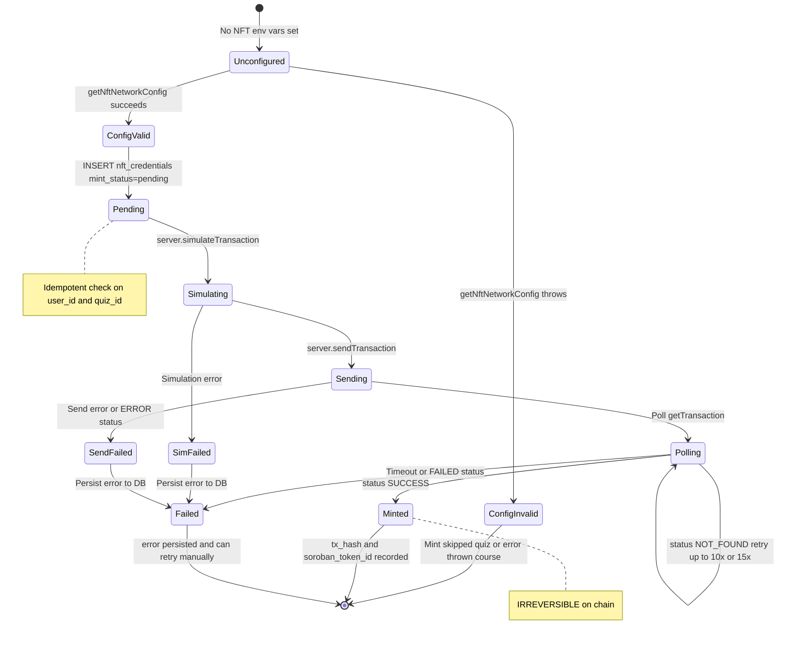

# NFT Credential State Machine

```mermaid
stateDiagram-v2
    [*] --> Unconfigured: No NFT env vars set

    Unconfigured --> ConfigValid: getNftNetworkConfig succeeds
    Unconfigured --> ConfigInvalid: getNftNetworkConfig throws

    ConfigValid --> Pending: INSERT nft_credentials mint_status=pending
    ConfigInvalid --> [*]: Mint skipped quiz or error thrown course

    Pending --> Simulating: server.simulateTransaction
    Simulating --> SimFailed: Simulation error
    Simulating --> Sending: server.sendTransaction

    Sending --> SendFailed: Send error or ERROR status
    Sending --> Polling: Poll getTransaction

    Polling --> Polling: status NOT_FOUND retry up to 10x or 15x
    Polling --> Minted: status SUCCESS
    Polling --> Failed: Timeout or FAILED status

    SimFailed --> Failed: Persist error to DB
    SendFailed --> Failed: Persist error to DB

    Minted --> [*]: tx_hash and soroban_token_id recorded
    Failed --> [*]: error persisted and can retry manually

    note right of Minted: IRREVERSIBLE on chain
    note right of Pending: Idempotent check on user_id and quiz_id
```
