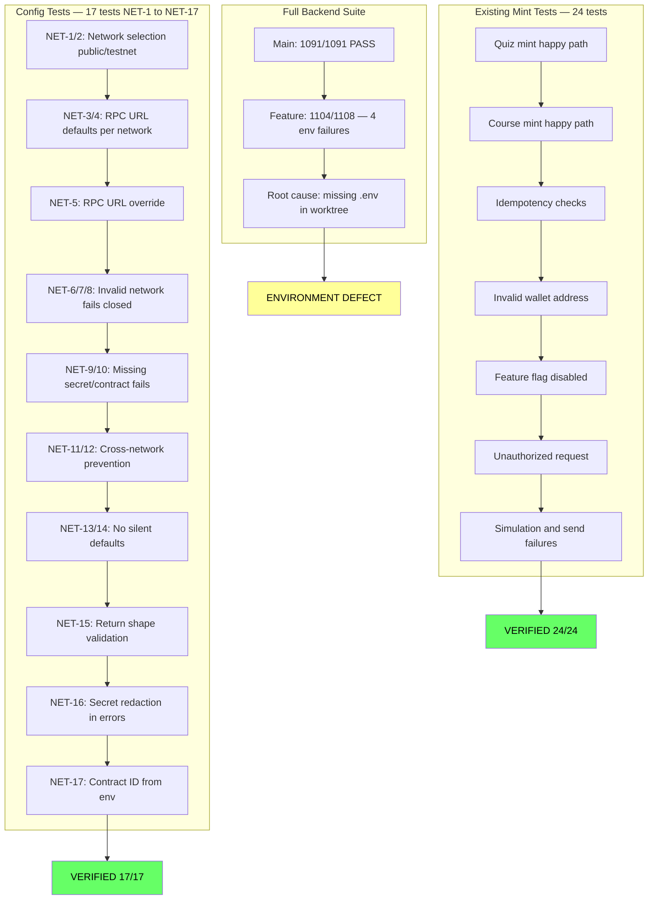

# NFT Test Flow

```mermaid
flowchart TD
    subgraph ConfigTests["Config Tests — 17 tests NET-1 to NET-17"]
        CT1["NET-1/2: Network selection public/testnet"]
        CT2["NET-3/4: RPC URL defaults per network"]
        CT3["NET-5: RPC URL override"]
        CT4["NET-6/7/8: Invalid network fails closed"]
        CT5["NET-9/10: Missing secret/contract fails"]
        CT6["NET-11/12: Cross-network prevention"]
        CT7["NET-13/14: No silent defaults"]
        CT8["NET-15: Return shape validation"]
        CT9["NET-16: Secret redaction in errors"]
        CT10["NET-17: Contract ID from env"]
        CT1 --> CT2 --> CT3 --> CT4 --> CT5 --> CT6 --> CT7 --> CT8 --> CT9 --> CT10
    end

    subgraph MintTests["Existing Mint Tests — 24 tests"]
        MT1["Quiz mint happy path"]
        MT2["Course mint happy path"]
        MT3["Idempotency checks"]
        MT4["Invalid wallet address"]
        MT5["Feature flag disabled"]
        MT6["Unauthorized request"]
        MT7["Simulation and send failures"]
        MT1 --> MT2 --> MT3 --> MT4 --> MT5 --> MT6 --> MT7
    end

    subgraph FullSuite["Full Backend Suite"]
        FS1["Main: 1091/1091 PASS"]
        FS2["Feature: 1104/1108 — 4 env failures"]
        FS3["Root cause: missing .env in worktree"]
        FS1 --> FS2 --> FS3
    end

    CT10 --> VR1["VERIFIED 17/17"]
    MT7 --> VR2["VERIFIED 24/24"]
    FS3 --> VR3["ENVIRONMENT DEFECT"]

    style VR1 fill:#6f6,color:#000
    style VR2 fill:#6f6,color:#000
    style VR3 fill:#ff9,color:#000
```
