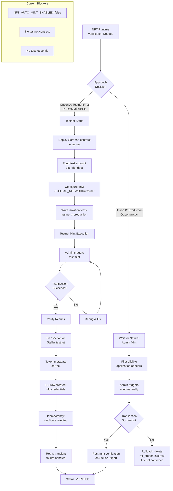

# NFT Testnet Verification Flow

Date: 2026-08-15 | Status: BLOCKED — APPROACH DECISION REQUIRED

```mermaid
flowchart TD
    A[NFT Runtime<br/>Verification Needed] --> B{Approach<br/>Decision}

    B -->|Option A: Testnet-First<br/>RECOMMENDED| C[Testnet Setup]
    C --> C1[Deploy Soroban contract<br/>to testnet]
    C1 --> C2[Fund test account<br/>via Friendbot]
    C2 --> C3[Configure env:<br/>STELLAR_NETWORK=testnet]
    C3 --> C4[Write isolation tests:<br/>testnet ≠ production]

    C4 --> D[Testnet Mint Execution]
    D --> D1[Admin triggers<br/>test mint]
    D1 --> D2{Transaction<br/>Succeeds?}

    D2 -->|Yes| E[Verify Results]
    E --> E1[Transaction on<br/>Stellar testnet]
    E1 --> E2[Token metadata<br/>correct]
    E2 --> E3[DB row created:<br/>nft_credentials]
    E3 --> E4[Idempotency:<br/>duplicate rejected]
    E4 --> E5[Retry: transient<br/>failure handled]
    E5 --> F[Status: VERIFIED]

    D2 -->|No| G[Debug & Fix]
    G --> D1

    B -->|Option B: Production<br/>Opportunistic| H[Wait for Natural<br/>Admin Mint]
    H --> H1[First eligible<br/>application appears]
    H1 --> H2[Admin triggers<br/>mint manually]
    H2 --> H3{Transaction<br/>Succeeds?}
    H3 -->|Yes| H4[Post-mint verification<br/>on Stellar Expert]
    H4 --> F
    H3 -->|No| H5[Rollback: delete<br/>nft_credentials row<br/>if tx not confirmed]

    subgraph "Current Blockers"
        X1[NFT_AUTO_MINT_ENABLED=false]
        X2[No testnet contract]
        X3[No testnet config]
    end
```
