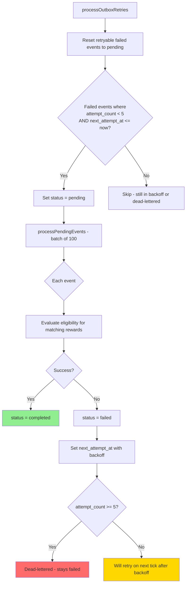

# Outbox Retry Flow

```mermaid
flowchart TD
    A[processOutboxRetries] --> B[Reset retryable failed events to pending]
    B --> C{Failed events where<br/>attempt_count < 5<br/>AND next_attempt_at <= now?}
    C -->|Yes| D[Set status = pending]
    C -->|No| E[Skip - still in backoff or dead-lettered]
    D --> F[processPendingEvents - batch of 100]
    F --> G{Each event}
    G --> H[Evaluate eligibility for matching rewards]
    H --> I{Success?}
    I -->|Yes| J[status = completed]
    I -->|No| K[status = failed]
    K --> L[Set next_attempt_at with backoff]
    L --> M{attempt_count >= 5?}
    M -->|Yes| N[Dead-lettered - stays failed]
    M -->|No| O[Will retry on next tick after backoff]

    style J fill:#90EE90
    style N fill:#FF6B6B
    style O fill:#FFD700
```

## Backoff Schedule
| Attempt | Delay |
|---------|-------|
| 1 | 30s |
| 2 | 60s |
| 3 | 120s |
| 4 | 240s |
| 5 | Dead-letter |
