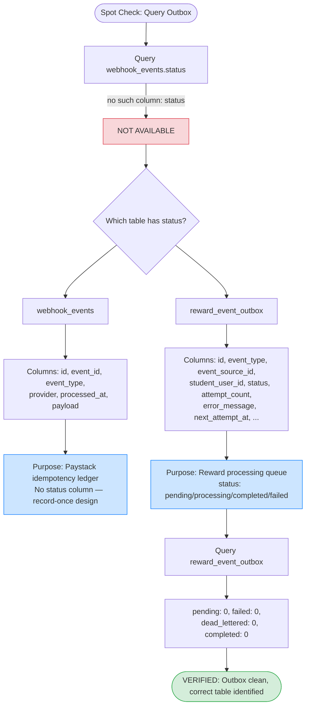

# Outbox Schema Investigation Flow

```mermaid
flowchart TD
    START([Spot Check: Query Outbox]) --> WRONG[Query webhook_events.status]
    WRONG --> |"no such column: status"| ERROR[NOT AVAILABLE]

    ERROR --> INVESTIGATE{Which table has status?}

    INVESTIGATE --> WE[webhook_events]
    INVESTIGATE --> REO[reward_event_outbox]

    WE --> WE_SCHEMA["Columns: id, event_id, event_type,
    provider, processed_at, payload"]
    WE_SCHEMA --> WE_PURPOSE["Purpose: Paystack idempotency ledger
    No status column — record-once design"]

    REO --> REO_SCHEMA["Columns: id, event_type, event_source_id,
    student_user_id, status, attempt_count,
    error_message, next_attempt_at, ..."]
    REO_SCHEMA --> REO_PURPOSE["Purpose: Reward processing queue
    status: pending/processing/completed/failed"]

    REO_PURPOSE --> QUERY[Query reward_event_outbox]
    QUERY --> STATS["pending: 0, failed: 0,
    dead_lettered: 0, completed: 0"]
    STATS --> RESOLVED([VERIFIED: Outbox clean, correct table identified])

    classDef pass fill:#d4edda,stroke:#28a745
    classDef fail fill:#f8d7da,stroke:#dc3545
    classDef info fill:#cce5ff,stroke:#007bff

    class RESOLVED pass
    class ERROR fail
    class WE_PURPOSE,REO_PURPOSE info
```
