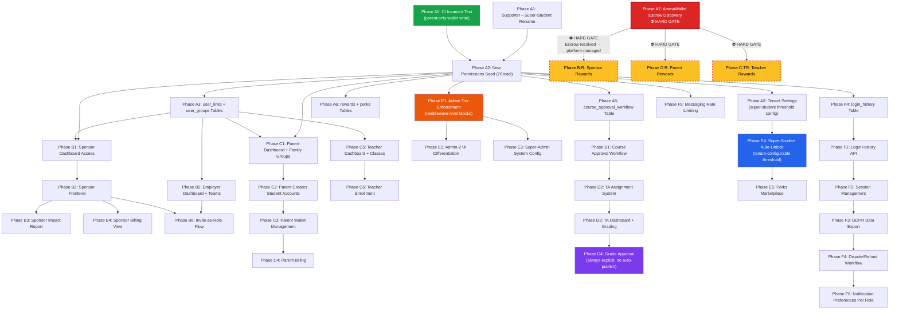

# Phase Dependency Diagram

## Build Phases — Dependency Graph



## Key

| Symbol | Meaning |
|---|---|
| ⛔ HARD GATE | AmmaWallet escrow discovery blocks all reward-funding work. **RESOLVED:** No escrow exists — rewards use platform-managed balances. |
| Red border (dashed) | Reward-related nodes — blocked until escrow gate resolved |
| Green (A0) | CI invariant test — already written and passing (12/12) |
| Orange (E1) | Admin tier enforcement — middleware-level, not UI-only (Decision #5) |
| Purple (D4) | TA grade approval — always explicit, never auto-publish (Decision #4) |
| Blue (E4) | Super-student auto-unlock — tenant-configurable threshold (Decision #2) |

## Parallel Execution

Phases B and C run in **parallel** (Decision #1). Both depend on Phase A foundation work completing first.

```
Phase A (foundation) ──┬──► Phase B (sponsor + employer)  ──┐
                       │                                      ├──► Phase D ──► Phase E ──► Phase F
                       └──► Phase C (parent + teacher)    ──┘
```
