# Phase Dependency Diagram

## Build Phases — Dependency Graph (Backend vs Frontend)

```mermaid
flowchart TD
    A0["Phase A0: CI Invariant Test<br/>(parent-only wallet write)"]
    A1["Phase A1: Supporter→Super-Student Rename"]
    A2["Phase A2: New Permissions Seed (79 total)"]
    A3["Phase A3: user_links + user_groups Tables"]
    A4["Phase A4: login_history Table"]
    A5["Phase A5: course_approval_workflow Table"]
    A6["Phase A6: rewards + perks Tables"]
    A7["Phase A7: AmmaWallet Escrow Discovery<br/>⛔ HARD GATE (RESOLVED)"]
    A8["Phase A8: Tenant Settings<br/>(super-student threshold config)"]

    B_BE["Phase B: Sponsor + Employer<br/>🔧 BACKEND COMPLETE"]
    C_BE["Phase C: Parent + Teacher<br/>🔧 BACKEND COMPLETE"]

    D_BE["Phase D: Instructor/TA<br/>🔧 BACKEND COMPLETE"]

    subgraph PARALLEL["⚡ Parallel Execution (worktrees)"]
        direction TB
        G_FE["Phase G: Frontend for B/C/D/TA Roles<br/>🖥️ FRONTEND COMPLETE"]

        E1["Phase E1: Admin Tier Enforcement<br/>(middleware-level blocks)"]
        E2["Phase E2: Admin-2 UI Differentiation"]
        E3["Phase E3: Super-Admin System Config"]
        E4["Phase E4: Super-Student Auto-Unlock<br/>(tenant-configurable threshold)"]
        E5["Phase E5: Perks Marketplace"]
        E6["Phase E6: Custom-User Permission<br/>Assignment Backend"]
        G4["Phase G4: Custom-User Permission<br/>Mapping Frontend"]
    end

    F1["Phase F1: Login History API"]
    F2["Phase F2: Session Management"]
    F3["Phase F3: GDPR Data Export"]
    F4["Phase F4: Dispute/Refund Workflow"]
    F5["Phase F5: Messaging Rate Limiting"]
    F6["Phase F6: Notification Preferences Per Role"]

    BR["Phase B-R: Sponsor Rewards"]
    CR["Phase C-R: Parent Rewards"]
    CTR["Phase C-TR: Teacher Rewards"]

    %% Phase A dependencies (all foundation)
    A0 --> A2
    A1 --> A2
    A2 --> A3
    A2 --> A4
    A2 --> A5
    A2 --> A6
    A2 --> A8

    %% Escrow gate (RESOLVED)
    A7 -->|"⛔ RESOLVED"| BR
    A7 -->|"⛔ RESOLVED"| CR
    A7 -->|"⛔ RESOLVED"| CTR

    %% Phase B/C backend
    A3 --> B_BE
    A2 --> B_BE
    A3 --> C_BE
    A2 --> C_BE

    %% Phase D backend depends on A5
    A5 --> D_BE

    %% Phase G frontend depends on B/C/D backend
    B_BE --> G_FE
    C_BE --> G_FE
    D_BE --> G_FE

    %% Phase E
    A2 --> E1
    A8 --> E4
    E1 --> E2
    E1 --> E3
    E4 --> E5
    E1 --> E6
    E6 -.->|"⚠️ G4 blocked on E6"| G4

    %% Phase F
    A4 --> F1
    F1 --> F2
    F2 --> F3
    F3 --> F4
    A2 --> F5
    F4 --> F6

    %% Styling — COMPLETE phases
    style A0 fill:#16a34a,color:#fff
    style A1 fill:#16a34a,color:#fff
    style A2 fill:#16a34a,color:#fff
    style A3 fill:#16a34a,color:#fff
    style A4 fill:#16a34a,color:#fff
    style A5 fill:#16a34a,color:#fff
    style A6 fill:#16a34a,color:#fff
    style A8 fill:#16a34a,color:#fff
    style B_BE fill:#16a34a,color:#fff
    style C_BE fill:#16a34a,color:#fff

    %% COMPLETE
    style D_BE fill:#16a34a,color:#fff
    %% COMPLETE — Phase E + G (merged from parallel worktrees 2026-08-13)
    style G_FE fill:#16a34a,color:#fff
    style E6 fill:#16a34a,color:#fff
    style G4 fill:#16a34a,color:#fff
    style E1 fill:#16a34a,color:#fff
    style E2 fill:#16a34a,color:#fff
    style E3 fill:#16a34a,color:#fff
    style E4 fill:#16a34a,color:#fff
    style E5 fill:#16a34a,color:#fff

    %% COMPLETE — Phase F Cross-Cutting Features (2026-08-13)
    style F1 fill:#16a34a,color:#fff
    style F2 fill:#16a34a,color:#fff
    style F3 fill:#16a34a,color:#fff
    style F4 fill:#16a34a,color:#fff
    style F5 fill:#16a34a,color:#fff
    style F6 fill:#16a34a,color:#fff

    %% Resolved gate
    style A7 fill:#6b7280,color:#fff,stroke:#6b7280

    %% Rewards (blocked until implementation)
    style BR fill:#fbbf24,color:#000,stroke:#dc2626,stroke-width:2px,stroke-dasharray:5
    style CR fill:#fbbf24,color:#000,stroke:#dc2626,stroke-width:2px,stroke-dasharray:5
    style CTR fill:#fbbf24,color:#000,stroke:#dc2626,stroke-width:2px,stroke-dasharray:5
```



## Key

| Color | Meaning |
|---|---|
| Green | COMPLETE (backend tests passing) |
| Green (D) | COMPLETE — Phase D Instructor/TA backend (25 tests) |
| Green (G) | COMPLETE — Phase G Frontend (193 tests, 9 new) |
| Green (E) | COMPLETE — Phase E Admin Tiers (29 new tests) |
| Gray (A7) | RESOLVED — Escrow gate closed, platform-managed balances |
| Yellow dashed | Reward phases — blocked until implementation |

## Backend vs Frontend Status

| Phase | Backend | Frontend |
|---|---|---|
| A (Foundation) | COMPLETE (770 tests) | N/A (schema + permissions only) |
| B (Sponsor/Employer) | COMPLETE (10 tests) | COMPLETE (Phase G) |
| C (Parent/Teacher) | COMPLETE (19 tests) | COMPLETE (Phase G) |
| D (Instructor/TA) | COMPLETE (25 tests) | COMPLETE (Phase G) |
| E (Admin Tiers) | COMPLETE (29 tests) | E2 backend flags only |
| F (Cross-Cutting) | NOT STARTED | NOT STARTED |
| G (Frontend Gap) | N/A | COMPLETE (9 tests) |

## Parallel Execution (Completed 2026-08-13)

```
Phase A (foundation) ──┬──► Phase B backend ──┐
                       │                       ├──► Phase D backend ──┬──► Phase G frontend ✅
                       └──► Phase C backend ──┘                      │
                                                                      ├──► Phase E backend ✅
                                                                      │         │
                                                                      │    E6 ──┘──► G4 ✅ (dependency satisfied)
                                                                      │
                                                                      └──► Phase F (next)
```

**Note:** Phase E and Phase G ran in separate git worktrees (zero file overlap: E = LMS-Server, G = LMS-Frontend).
G4→E6 dependency respected: E6 completed in backend worktree before G4 merged. Zero merge conflicts.
