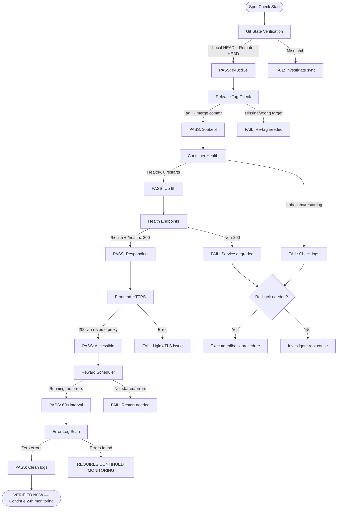

# Post-Deployment Spot Check Flow

```mermaid
flowchart TD
    START([Spot Check Start]) --> GIT[Git State Verification]
    GIT --> |Local HEAD = Remote HEAD| GIT_PASS[PASS: d40cd3e]
    GIT --> |Mismatch| GIT_FAIL[FAIL: Investigate sync]

    GIT_PASS --> TAG[Release Tag Check]
    TAG --> |Tag → merge commit| TAG_PASS[PASS: 305bebf]
    TAG --> |Missing/wrong target| TAG_FAIL[FAIL: Re-tag needed]

    TAG_PASS --> CONTAINER[Container Health]
    CONTAINER --> |Healthy, 0 restarts| CONT_PASS[PASS: Up 6h]
    CONTAINER --> |Unhealthy/restarting| CONT_FAIL[FAIL: Check logs]

    CONT_PASS --> HEALTH[Health Endpoints]
    HEALTH --> |/health + /healthz 200| HEALTH_PASS[PASS: Responding]
    HEALTH --> |Non-200| HEALTH_FAIL[FAIL: Service degraded]

    HEALTH_PASS --> FRONTEND[Frontend HTTPS]
    FRONTEND --> |200 via reverse proxy| FE_PASS[PASS: Accessible]
    FRONTEND --> |Error| FE_FAIL[FAIL: Nginx/TLS issue]

    FE_PASS --> SCHEDULER[Reward Scheduler]
    SCHEDULER --> |Running, no errors| SCHED_PASS[PASS: 60s interval]
    SCHEDULER --> |Not started/errors| SCHED_FAIL[FAIL: Restart needed]

    SCHED_PASS --> LOGS[Error Log Scan]
    LOGS --> |Zero errors| LOGS_PASS[PASS: Clean logs]
    LOGS --> |Errors found| LOGS_WARN[REQUIRES CONTINUED MONITORING]

    LOGS_PASS --> RESULT([VERIFIED NOW — Continue 24h monitoring])

    HEALTH_FAIL --> ROLLBACK{Rollback needed?}
    CONT_FAIL --> ROLLBACK
    ROLLBACK --> |Yes| ROLLBACK_EXEC[Execute rollback procedure]
    ROLLBACK --> |No| INVESTIGATE[Investigate root cause]
```
