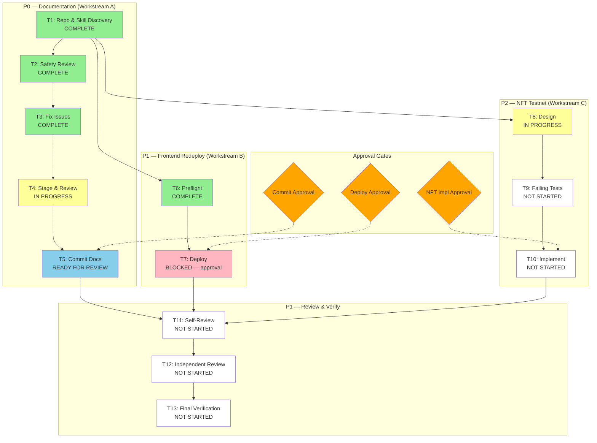

# Post-Release Follow-Up Dependency Map

Date: 2026-08-15 | Stellar SDK v16 Upgrade

Legend:
- Green: COMPLETE
- Yellow: IN PROGRESS
- Blue: READY FOR REVIEW
- Pink: BLOCKED (awaiting approval)
- White: NOT STARTED
- Orange: Approval gate
