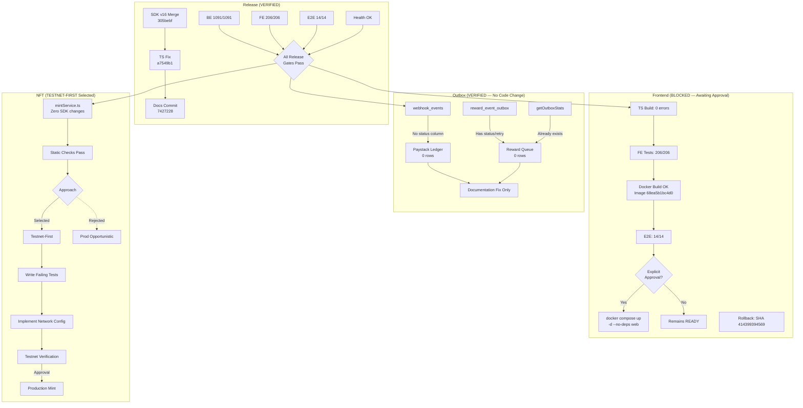

# Post-Release Follow-Up Context

Date: 2026-08-15 | Stellar SDK v16 Upgrade — Complete Follow-Up

```mermaid
graph TD
    subgraph "Release (VERIFIED)"
        R1[SDK v16 Merge<br/>305bebf] --> R2[TS Fix<br/>a7549b1]
        R2 --> R3[Docs Commit<br/>7427228]
        R4[BE 1091/1091] --> R5{All Release<br/>Gates Pass}
        R6[FE 206/206] --> R5
        R7[E2E 14/14] --> R5
        R8[Health OK] --> R5
    end

    subgraph "Outbox (VERIFIED — No Code Change)"
        O1[webhook_events] -->|No status column| O2[Paystack Ledger<br/>0 rows]
        O3[reward_event_outbox] -->|Has status/retry| O4[Reward Queue<br/>0 rows]
        O5[getOutboxStats] -->|Already exists| O4
        O2 --> O6[Documentation Fix Only]
        O4 --> O6
    end

    subgraph "Frontend (BLOCKED — Awaiting Approval)"
        F1[TS Build: 0 errors] --> F2[FE Tests: 206/206]
        F2 --> F3[Docker Build OK<br/>Image 68ea5b1bc4d0]
        F3 --> F4[E2E: 14/14]
        F4 --> F5{Explicit<br/>Approval?}
        F5 -->|Yes| F6[docker compose up<br/>-d --no-deps web]
        F5 -->|No| F7[Remains READY]
        F8[Rollback: SHA 414399394569]
    end

    subgraph "NFT (TESTNET-FIRST Selected)"
        N1[mintService.ts<br/>Zero SDK changes] --> N2[Static Checks Pass]
        N2 --> N3{Approach}
        N3 -->|Selected| N4[Testnet-First]
        N4 --> N5[Write Failing Tests]
        N5 --> N6[Implement Network Config]
        N6 --> N7[Testnet Verification]
        N7 -->|Approval| N8[Production Mint]
        N3 -.->|Rejected| N9[Prod Opportunistic]
    end

    R5 --> O1
    R5 --> F1
    R5 --> N1
```
